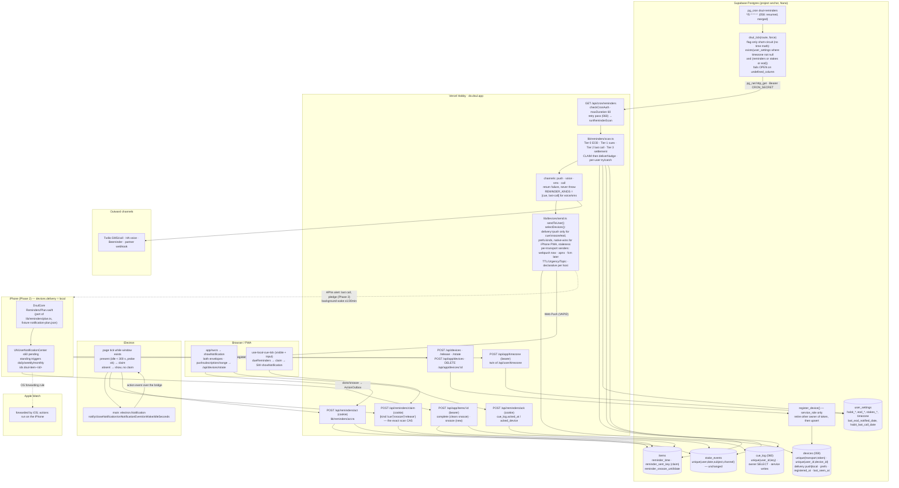

# Reminders across platforms — web, desktop, iPhone, watch, Android

2026-10-05. **Status: plan, decided 2026-10-06 — Kirby took every default in §7; nothing in it has been built yet, nothing was written to prod.** Phase 0 is next. Every code citation is tree-level (`main` at `b8d480c`, 2026-10-04; every cited `file:line` holds at `3200896`, #405, 2026-10-05 — six cited files changed between the two commits, `electron/main.cjs`, `electron/preload.cjs`, `lib/desktop.ts`, `desktop-app.md`, `ios-app.md`, `CLAUDE.md`, but not at the cited lines; `preload.cjs` gained `authProviders`): the live project was read on 2026-10-05, read-only, and the observed values sit at the top of §5.1.1: the organisation is on the **Pro** plan, both ticks are paused exactly as 045 left them, no ritual is enabled by any of the four accounts, and Kirby is the only user, so the runbook's EXPECT lines are now observations and the §5.1 writes have no one to disturb. Kirby also holds a paid Apple Developer Program membership (confirmed 2026-10-05), which removes the purchase gate the brief assumed (decision 5, resolved). Facts taken from search snippets of pages the planning sessions could not open are marked `[S]`; facts no source verified are marked **[unverified]** inline and collected in §6. Sibling plans: [habit-reminders.md](habit-reminders.md) (the reminder model this builds on — read it first), [desktop-app.md](desktop-app.md), [ios-app.md](ios-app.md).

---

## 1. Recommendation

Keep the server as the only authority on whether a cue is **owed** and **discharged** (`lib/reminders/due.ts` and the claims in `scan.ts` already are) and in Phase 0 make that clock cheap and honest rather than replace it: fold `/api/cron/eod-notify` into the scan as a claim-then-deliver tier, make the push channel say `unreached` instead of `ok` at zero devices, carry `TTL`/`Urgency`/`Topic` on web pushes, short-circuit an idle tick inside Postgres with **no time arithmetic in SQL**, keep `*/5`, and un-pause one merged pg_cron job through migration 058 after a read-only runbook. Then (Phase 1) replace `push_subscriptions` with a `devices` registry whose only writer is a service-role `register_device()` — the only shape that closes #254 under RLS — let an open web or Electron page act as a device by claiming through `POST /api/reminders/claim`, and start a `cue_log` ledger. For the iPhone (Phase 2, no paid team) make the phone the clock for the per-item cue, its snooze and the EOD review with standing triggers computed by a fixture-checked `lib/reminders/plan.ts` and its Swift twin; keep the last call server-computed; route native Done/Snooze through the existing `/api/app/items/:id` intents so Beeminder's live path holds everywhere. APNs, a signed Electron build, Time Sensitive, Android and a watch app each wait for a concrete trigger; nothing in Phases 0–2 is undone to add them. One rule guards the whole thing: **one scheduler per device, never two.**

### Where each question is answered

| Question | Section |
|---|---|
| 1. Delivery architecture per platform (reliability, offline, battery, OS limits, one source of truth) | §2 (per platform, each with an "OS limits and battery" row), §3.1 (the one scan), §3.4 (scheduler comparison) |
| 2. Cross-device behaviour | §3.5 (rules table), §2 "Withdrawal" rows, §3.3 (Done/Snooze paths) |
| 3. What drives the server clock | §3.4 (options, costs, #276's numbers), §3.6 (the gate), §5.1 (Phase 0) |
| 4. Device registry | §3.2, §4.2 (migration 059), §5.2 (Phase 1) |
| 5. Apple Watch | §2.5, §5.7 (Phase 6) |
| 6. iOS specifics | §2.3; §5.3 (Phase 2: local triggers, grouping, categories); §5.4 (Phase 3: APNs, Time Sensitive on APNs); §5.5 (Phase 4: Focus filters, widgets, the Control); §5.9 (AlarmKit, Live Activities); Appendix B 1–2 |
| 7. Phase 0 | §5.1 (prod-touching table, runbook, PRs, 058, un-pause, verification, stakes) |
| 8. Phasing and migration | §5 (all phases, costs), §4 (SQL) |
| 9. Testing | §5 per phase "Tests" rows, §5.8 (drift gates and the bare-Postgres replay) |

---

## 2. Per-platform delivery

The invariant every row keeps: a device may *compute* "wants doing" through the TS itself or a fixture-checked port, and may *show* a cue, but the server row is the only place "owed" and "discharged" are decided for server channels, and **each device row is served by exactly one path** (`devices.delivery`, §4.2): a row the server pushes to never also schedules locally, and vice versa.

### 2.1 Web and PWA (desktop Chrome/Edge/Firefox, Android Chrome, iPhone Home Screen app)

| | |
|---|---|
| **Delivery mode** | Server push over Web Push, as today — there is no local scheduler on the web (the Notification Triggers API never shipped; the server scan is the web's only clock). Plus, in Phase 1, the **open page as a device**: while a tab is visible and recently used, a 60 s tick runs `dueReminders` on the planner store's items and asks `POST /api/reminders/claim` to claim; a won claim is shown through `(await navigator.serviceWorker.ready).showNotification(...)` — never `new Notification(...)`, which throws `Illegal constructor` on Android Chrome (certain) and whose behaviour in an iOS Home Screen app is **[unverified]** (browser-compat data says the `Notification` interface is defined there only for a home-screen web app, and says nothing about the constructor). The `showNotification`-only rule is right either way |
| **What rings** | Cue, snoozed cue, last call, EOD review, pledge notice; every push carries `TTL` = remaining window clamped at local midnight, `Urgency: high` (cue/last call) or `normal` (EOD/pledge), `Topic` ≤ 32 URL-safe chars (the item UUID's 32 hex digits; `lc-<yyyymmdd>`; `eod-<yyyymmdd>`; `pl-<yyyymmdd>`) — RFC 8030 §5.2–5.4 (https://www.rfc-editor.org/rfc/rfc8030). For `*.push.apple.com` endpoints (iOS 18.4+ Home Screen apps) the sender sends the **Declarative Web Push** envelope `{ web_push: 8030, notification: { title, body, navigate, tag, data } }`, chosen per endpoint host (WWDC25 session 235; Safari 18.4 release notes); `app/sw.ts` reads both envelopes |
| **Done / Snooze** | Chromium and Firefox 152+: the two SW actions (`done`, `snooze` — the literal ids in `lib/reminders/channels/push.ts:16-17`) → `POST /api/reminders/act` with the cookie, unchanged (`actions`/`maxActions`: Chrome 53/48, Firefox 152, per `mdn/browser-compat-data` `api/Notification.json`). Safari macOS and the iPhone PWA: no actions (`maxActions` is commented out in WebKit's `Source/WebCore/Modules/notifications/Notification.idl`); a tap opens `/item/<id>` (`navigate` in the declarative shape) |
| **Withdrawal** | Open page: `registration.getNotifications({ tag })` → `close()`, free. Closed browser: **the stale cue stays**. A silent withdraw spends Chrome's engagement budget ("This site has been updated in the background", `chrome/browser/push_messaging/push_messaging_notification_manager.cc` `[S]` for the visible string) and counts toward WebKit's `maxSilentPushCount = 3` (`Source/WebKit/Shared/WebPushDaemonConstants.h`) after which the origin is unsubscribed with no `pushsubscriptionchange` on iOS. The visible silent replacement (`renotify: false`, `silent: true`, body `"<title> · done on your phone"`) is specified as a per-device opt-in, default off. **Never** a withdraw, replacement or in-window re-send to an Apple endpoint |
| **OS limits and battery** | Every `push` event ends in `showNotification` (Chrome budget, WebKit three strikes); `tag` has no effect on Safari so `Topic` is the only coalescing there; Chrome expires subscriptions idle ~9 months then 404s `[S]`; Safari answers 200/201 for dead subscriptions (https://developer.apple.com/forums/thread/719990) so `last_seen_at` is its only prune signal. Battery: the page tick runs **only while the tab is visible**, over in-memory items, and touches the network only on a claim; a hidden tab costs nothing and the closed browser is served by push alone |
| **Needs that do not exist yet** | `pushsubscriptionchange` handler in `app/sw.ts` (Chrome 138+, Safari macOS 16, absent on Safari iOS); boot-time re-post from `AppShell` (today only `/settings` observes the subscription — `hooks/use-push-subscription.ts` has one consumer, `app/settings/[[...pane]]/page.tsx:33`); the three sign-out sites (`components/planner/user-profile-dropdown.tsx:67`, `components/sidebar/user-card.tsx:68`, `app/settings/[[...pane]]/page.tsx:367`) and the `SIGNED_OUT` branch (`components/providers/supabase-provider.tsx:605-637`) releasing the row **before** `unsubscribe()` (#254); `lib/sw/handlers.ts` extracted so the SW is testable; `TTL`/`Urgency`/`Topic` in `lib/push-send.ts:107` (none today); the claim and ack routes and `hooks/use-local-cue-tick.ts` |

### 2.2 Electron desktop

| | |
|---|---|
| **Delivery mode** | **Device-local, page-driven**: the loaded `do.dsul.app` page is the desktop's clock (it holds `items[]` and runs the real `lib/reminders/due.ts`; no port). `PushManager.subscribe()` rejects in Electron ("Registration failed - push service not available", https://github.com/electron/electron/issues/3095; **[unverified on a device]** by this project, as [desktop-app.md](desktop-app.md) already says), and `push-receiver`/MCS, a long-poll and main-process timers are each rejected (reverse-engineered protocol; a second clock). Three Electron-specific rules: the tick runs while the window **exists** (tray-parked included) with `backgroundThrottling: false` on the one `WebContents`; presence is `powerMonitor.getSystemIdleTime() < 300` s via a new preload `idleSeconds()`, not page input; and **absent → show locally without claiming**, so the phone still rings for a user who walked away. Main pokes the page on `resume`/`unlock-screen` (`onWake`) so the first tick after sleep is immediate. **The page claims only after a boot-time silent `notify` probe resolved `ok`** (design decision 20 in §3.5): on a build whose notifications cannot appear, a claim would silence every other channel for a cue nobody sees |
| **What rings** | Cue and snoozed cue (the desktop's own snoozes re-ring through a second claim kind `{ kind: 'snooze', itemId, dateStr, held }`); EOD review while the page is open; **no last call** (per-user day stamp, server-only; the Devices pane says so). Main posts an `electron.Notification` through four new `fromApp()`-checked preload methods — `notify`, `closeNotification`, `onNotificationEvent`, `onWake` — with Done as the primary button and Snooze under hover on macOS, both as toast buttons on Windows; the renderer `new Notification()` is only the fallback when `notify` answers `unsupported` |
| **Done / Snooze** | The action event reaches the page over the bridge; the page POSTs `/api/reminders/act` with its cookie exactly as the SW does (main holds no session); failure → sonner toast "Couldn't save that — <title> is still open" and `openEditFor` |
| **Withdrawal** | `bridge.closeNotification(tag)` when the page's own store learns the completion (same tab / next planner refresh); within a second once Supabase Realtime Broadcast is adopted as the **withdraw/wake** channel (never the clock), later phase |
| **OS limits and battery** | macOS: visible notifications need a **signed** build ("your application will need to be code-signed in order for notification events to emit correctly … Unsigned binaries will emit a `failed` event", https://www.electronjs.org/docs/latest/tutorial/notifications; the release workflow also notarizes, which notifications do not require) and action buttons additionally need `NSUserNotificationAlertStyle = alert` in Info.plist (https://www.electronjs.org/docs/latest/api/structures/notification-action). The claim that the renderer path sidesteps signing is **[unverified]** and mechanically doubtful — both paths reach the same `UNUserNotificationCenter` presenter. Windows: `app.setAppUserModelId('app.dsul.desktop')` is already called (`electron/main.cjs:163`); toasts need no signing. Timers do not run through sleep `[S]`, so the tick recomputes from the wall clock every run. `reloadOnOnline: false` with a refetch-on-`online` in `AppShell`, because Serwist's reload on every wake throws away the tick, any Realtime subscription and any draft. **Battery**: `backgroundThrottling: false` keeps one timer a minute alive for the whole `WebContents` while the window exists, including tray-parked on a laptop on battery; nothing touches the network unless something is due. That cost is accepted on a measurement trigger, not a prior: a tray-parked day's energy impact (Activity Monitor) is on Phase 1's device checklist, and `powerMonitor.onBatteryPower` → a 5-minute tick is the lever if the number says so |
| **Needs that do not exist yet** | The five preload members and `lib/desktop.ts`/`types/dsul-desktop.d.ts` twins (today the preload exposes `version`, `shellVersion`, `electronVersion`, `platform`, `authProviders` (since #405) and the methods `onQuickCapture`, `openAuthUrl`, `armEmailSignIn`, `takeSignInNotice`, `setAppIcon` — nothing notification-related); `electron/lib/notify.cjs` (pure, unit-testable); `mac.extendInfo: { NSUserNotificationAlertStyle: 'alert' }` in `electron/electron-builder.config.cjs` (no `extendInfo` today); `backgroundThrottling` in `createWindow`'s `webPreferences` (`electron/main.cjs:264-272` has none); the Developer ID certificate and the five `DESKTOP_*` secrets (`.github/workflows/desktop-release.yml:10-16`) — from the team Kirby already holds, so the signed release can land with Phase 1; a `devices` row `platform: 'electron'`, `transport: 'none'`, `prefs.claimsLocally` set from the probe; the `rituals.push` row's desktop copy (`lib/settings/manifest.ts:1296-1304`) replaced |

### 2.3 iOS native

| | |
|---|---|
| **Delivery mode** | **Device-local for the per-item cue, its snooze and the EOD review** (Phase 2, no entitlement needed); **server APNs alert for the last call and stake notices**; **APNs background only as a throttled wake** (Phase 3, which follows Phase 2 directly: Kirby holds the paid team as of 2026-10-05, so APNs is not blocked, it is simply not the cue's clock). Local triggers are chosen because they ring offline and on the minute, and because APNs on an offline phone stores **one** notification per bundle id (https://developer.apple.com/documentation/usernotifications/sending-notification-requests-to-apns). A "deferred local shadow" (server push plus a local trigger on one phone) is rejected outright — two schedulers on one device. The tree is still unsigned (`ios/project.yml:12` `DEVELOPMENT_TEAM: ""`, CI `CODE_SIGNING_ALLOWED=NO` at `.github/workflows/ios.yml:106`); Phase 2 sets the team id in `project.yml` while CI stays unsigned |
| **What rings** | A standing repeating `UNCalendarNotificationTrigger` per daily / weekly / monthly habit (one slot each, counts once against the 64-pending cap: "automatically rescheduled notifications counting as a single notification", https://developer.apple.com/documentation/uikit/uilocalnotification; https://developer.apple.com/forums/thread/811171). When today is done / skipped / tallied / paused / season-inactive (decision 3 of [habit-reminders.md](habit-reminders.md) expressed locally) the slot is **not** replaced by a bare one-off: **a non-repeating request fires once and does not launch the app**, so a bare one-off would leave the phone silent from the day after next if dsul is not opened. Instead the slot becomes a repeating `UNTimeIntervalNotificationTrigger` (24 h for daily, 7 d for weekly; `repeats: true`, https://developer.apple.com/documentation/usernotifications/untimeintervalnotificationtrigger/init(timeinterval:repeats:)) anchored at the next wanted cue, which keeps ringing until the next re-plan at the cost of up to one hour of DST drift that the next re-plan corrects; monthly habits and over-budget custom weekday sets keep a one-off and add a second only while under budget; the plan restores the calendar trigger at the first reconcile after today's cue time (an explicit `plan.ts` rule with a fixture row). One-offs for anchored tasks, snoozes (under `dsul-item-<id>#snooze`, never the item's own id), and any cue time in 01:00–03:59 (so no repeating trigger sits on a DST boundary); a catch-up immediate request when a cue is armed inside its own window, deduped by `localSentKeys`. EOD is a standing trigger that is **never removed**: while `last_eod_review_date == today` it is replaced by the same 24 h interval trigger anchored at tomorrow's review time. **No local last call** — a list computed at the last plan names habits already done elsewhere, the one scold the copy contract (`tests/unit/reminders-copy.test.ts:104-107`) cannot send. Residual bound, stated in Settings copy: *a habit ticked before its cue time on a phone not opened for two days can pause that iPhone's cue until dsul next opens*. Budget 60 of 64. Identifier `dsul-item-<id>` does triple duty (replace pending, replace delivered, withdraw); custom-weekday splits are `dsul-item-<id>#<weekday>` with `identifiers(for:)` expanding them; scheduling a snooze also calls `removeDeliveredNotifications([dsul-item-<id>])`. Grouping: `threadIdentifier` `dsul.cues` for cues and snoozes, `dsul.rituals` for EOD and last call, with `summaryArgument` = the item title so a collapsed stack reads "3 more from dsul · Vitamins, Reading …" (https://developer.apple.com/documentation/usernotifications/unnotificationcontent/threadidentifier). `willPresent` re-checks `wantsDoingOn` against the in-memory planner at the last possible moment |
| **Done / Snooze** | `DSUL_CUE` category, actions literally `done` / `snooze`, without `authenticationRequired` (lock-screen Done is the feature — [habit-reminders.md](habit-reminders.md) evidence 4; https://developer.apple.com/documentation/usernotifications/unnotificationactionoptions). The delegate appends to a **persisted, file-protected `ActionOutbox`** (`.completeUntilFirstUserAuthentication`, because "Users can respond to actions while the device is locked, which would make files encrypted with the complete option unavailable", https://developer.apple.com/documentation/usernotifications/declaring-your-actionable-notification-types; the in-memory queue is lost on kill) drained by `PlannerSync` → `POST /api/app/items/:id` with the existing `complete` intent (which gains "clear the snooze columns") or a **new `snooze` intent** writing `reminder_snooze_until/date` with the day gate. One write path keeps `reportStake` inside `after()` (`lib/app-api.ts:664-677`) so every Apple-side completion reaches Beeminder live, as the phone's completions already do. No bearer twin of `/api/reminders/act` |
| **Withdrawal** | Local: re-plan on every local write, foreground, `NSCalendarDayChanged`, `BGAppRefreshTask` (opportunistic, ≤ 30 s, one pending; https://developer.apple.com/documentation/backgroundtasks/bgtaskscheduler/submit(_:)) — diff pending **and** delivered sets. Remote (Phase 3): ≤ 1 APNs background push per device per **30 min** (two an hour, under Apple's "don't try to send more than two or three per hour" and the three-per-hour rate limit), only to devices with a planned cue in the next 24 h, skipping the writer device (`X-Dsul-Device` header on `/api/app` writes), `apns-expiration: 0`; plus `mutable-content: 1` on every visible alert so the NSE removes withdrawn ids listed in the payload before presenting. Until Phase 3, and for ever on a force-quit app (the system discards a held background push "If something force quits or kills the app"): **a habit ticked on the Mac at 07:00 may buzz the phone at 07:30**, said in Settings copy |
| **OS limits and battery** | 64 pending (standing triggers count once); background pushes "two or three per hour" with rate limiting above three (https://developer.apple.com/documentation/usernotifications/pushing-background-updates-to-your-app; https://developer.apple.com/documentation/backgroundtasks/choosing-background-strategies-for-your-app) — the 30-minute throttle sits under it, and a force-quit app receives none; APNs stores **one** notification per bundle id per offline device; Time Sensitive needs no Apple approval but **does need the paid Program** (Apple's "Supported capabilities (iOS)" table checks it for ADP and ADEP only; the free "Apple Developer" column is empty — https://developer.apple.com/help/account/reference/supported-capabilities-ios/) — per item, opt-in, off by default, Phase 4 after Phase 3's purchase; no Critical Alerts (approved entitlement); badge always zero; permission asked after the first reminder is set, never at launch (HIG; "you might make the request after the person schedules a first task", https://developer.apple.com/documentation/usernotifications/asking-permission-to-use-notifications). App Review: 4.5.4 — push is never required for the app to work, and stake/last-call pushes are utility, never marketing (no re-engagement nudges); 5.1.1(iv) — every feature works with permission denied and the Remind sheet says so; 2.5.4 — the `fetch` background mode is used only for the reconcile (https://developer.apple.com/app-store/review/guidelines/, "Updated: June 8, 2026"). **Battery**: no polling — the triggers are held by the OS, `BGAppRefresh` is opportunistic and learns usage, and the Phase 3 wakes sit under Apple's budget; the planner fetch stays at most once a minute on foreground as today (`ios/Dsul/Data/PlannerSync.swift:64-65`) |
| **Needs that do not exist yet** | Everything: the phone has no notification code at all (no `UserNotifications` import, no `UNUserNotificationCenter`, no entitlements file, no `UIBackgroundModes` — `ios/project.yml` has no `entitlements:` key). DsulCore ports `Reminders/{Due,Copy,Snooze,Plan}.swift` (fixture-checked); hosted `ios/Dsul/Notifications/{NotificationCenterPort,NotificationScheduler,NotificationDelegate,NotificationCategories,ActionOutbox,PlannerCache,BackgroundRefresh}.swift`; `ios/Dsul/App/AppDelegate.swift` (`UIApplicationDelegateAdaptor`, none today — `ios/Dsul/App/DsulApp.swift:8-31`); `project.yml`: `UIBackgroundModes: [fetch]`, `BGTaskSchedulerPermittedIdentifiers: [app.dsul.ios.reconcile]`; `POST /api/app/timezone` (the phone reads the zone and never writes it, `ios/Dsul/Model/SamplePlanner.swift:222-225`); the planner payload's ritual settings; `PlannerCache` on disk (reverses "nothing it fetches should outlive the session on disk", `ios/Dsul/Data/APIClient.swift:22-26` — decision 10). Phase 3 adds `aps-environment`, `remote-notification`, `PushRegistrar.swift`, the NSE target |

### 2.4 Android (future)

| | |
|---|---|
| **Delivery mode** | **Server push is primary**: FCM HTTP v1 **data** messages at `HIGH` priority rendered by a native `FirebaseMessagingService` — the opposite of iOS, a consequence of the platforms, not an inconsistency. `SCHEDULE_EXACT_ALARM` is denied by default on Android 14 for a non-calendar/alarm app and revocation cancels every alarm (https://developer.android.com/about/versions/14/changes/schedule-exact-alarms); `USE_EXACT_ALARM` is Play-policy-gated `[S]` (https://support.google.com/googleplay/android-developer/answer/9888170); inexact alarms land "within one hour" (https://developer.android.com/develop/background-work/services/alarms/schedule). Exact alarms are an **opt-in accelerator** only while granted, with `delivery = 'local'` on the row so the server stops pushing cues to it — one path per device. Client: a Capacitor shell over the live origin plus a small Kotlin layer, built only when an Android user uses dsul daily |
| **What rings** | Cue, snooze, last call (HIGH); EOD, pledge, withdraw (NORMAL). `collapse_key` by **kind** (`cue | last-call | eod | withdraw`: "A maximum of four different collapse keys may be active at any given time", https://firebase.google.com/docs/cloud-messaging/customize-messages/collapsible-message-types `[S]`, and the firebase-admin-node API text), `tag` by item (`dsul-item-<id>`), `android.ttl` = remaining window, immutable channel ids with a version suffix (`cues.v1`, `last-call.v1`, `rituals.v1`, `ledger.v1`); the renderer re-checks `windowEnd` in the device zone. Three actions: Done · Snooze 15m · Skip (once `skip` exists in `lib/reminders/act.ts`) |
| **Done / Snooze** | `ActionReceiver` (BroadcastReceiver) → WorkManager → `POST /api/reminders/act` with the WebView's cookies (`CookieManager`), bearer as the fallback if the device test fails **[unverified]** |
| **Withdrawal** | FCM `withdraw` data message at NORMAL priority → `NotificationManager.cancel(tag)`; `WearableExtender().setDismissalId(tag)` — the per-item tag `dsul-item-<id>`, never the kind-level collapse key, because "all other notifications with the same dismissal ID are dismissed on the watch and on the phone" (https://developer.android.com/training/wearables/notifications/bridger) and a kind-level id would dismiss every cue at once |
| **OS limits and battery** | Every HIGH message yields a visible notification (the 7-day deprioritisation rule, https://firebase.google.com/docs/cloud-messaging/android-message-priority `[S]`); no full-screen intents; no battery-optimisation exemption; Restricted bucket gets one alarm a day (https://developer.android.com/topic/performance/appstandby), which is why alarms are never the clock; `POST_NOTIFICATIONS` asked in context on 13+. Battery: FCM's own connection is the only wake; no polling, no WorkManager periodic |
| **Needs that do not exist yet** | All of it: `android/` tree (never a pnpm member), `android/dsulcore` JVM twin of `wantsDoingOn`/`isWithinWindow`/`minutesOfDay`/copy reading the same `tests/fixtures/day/*.json`, `lib/devices/transports/fcm.ts`, `FCM_PROJECT_ID`/`FCM_SERVICE_ACCOUNT` env, `android.yml` CI (not required) |

### 2.5 Apple Watch

| | |
|---|---|
| **Delivery mode** | **Forwarded iPhone notifications, zero watch targets** (Phase 2, free). Apple routes each notification to phone *or* watch: "If the user's iPhone is unlocked and the screen is on, notifications go to the phone. Otherwise, if the Apple Watch is on the user's wrist and unlocked, notifications go to the watch. Otherwise, notifications default back to iPhone" (https://developer.apple.com/documentation/watchos-apps/taking-advantage-of-notification-forwarding); the category and actions are defined in the iOS app and a background action "runs in the background on their iPhone" (https://developer.apple.com/documentation/watchos-apps/adding-actions-to-notifications-on-watchos). On watchOS 26 the iPhone's Controls appear on the watch and run on the phone (WWDC25 session 334), so a `ControlWidgetButton` "Done: <next cue>" bound to a `CompleteItemIntent` is a wrist tick with no watch app (Phase 4) |
| **What rings** | Whatever the phone would have shown, with the long look's Done/Snooze; Double Tap runs the first non-destructive action (Done listed first). Dismissal syncs both ways (https://support.apple.com/en-us/108274 `[S]`) |
| **Done / Snooze** | Same as iOS — the action runs on the iPhone |
| **Withdrawal** | Dismissed with the phone's copy by the system |
| **OS limits and battery** | A watch app that scheduled its own cues while a companion phone also did would ring the wrist twice (local notifications are per device; only simultaneous remote sends are deduped — WWDC19 session 208) — so a watch app must **never** own the per-item cue; forwarding is OS-routed and un-overridable (https://developer.apple.com/forums/thread/37273). Battery: forwarding costs the watch nothing dsul controls |
| **Needs that do not exist yet** | Nothing for v1 beyond Phase 2. Phase 6: `DsulWatch` + `DsulWatchWidgets` targets, App Group, `RelevanceConfiguration` "next cue" (watchOS 26 only), WC relay, optional magic-link own session |

---

## 3. Architecture

### 3.1 The one scan

`runReminderScan(service, { now })` (`lib/reminders/scan.ts`) stays the single decision-maker for server channels. Per user, inside one `try` (`scan.ts:254`, catch at `:470`): **Tier 0 EOD** (new; owed = `isEodOwed` from `lib/eod.ts:49`, with `eod_review_time` parsed by `lib/eod.ts`'s own `minutesOfDay` (`:30-37`, which accepts `9:00`), not `due.ts:49`'s strict `HH:mm` parser — `eod_review_time` has no CHECK (`supabase/migrations/010_notification_settings.sql:5`) and `lib/eod-store.ts` saves what it is given, so the strict parser would silently flip an unpadded stored value from "sent today" to "never sent"; window = `isWithinWindow(eodMinutes, clock.nowMinutes)` clamped; claim `last_eod_notified_date`; then deliver **through `deliverNudge` with the `REMINDER_KINDS` filter**, never by calling `pushChannel.deliver` directly — the push channel can reject today (`lib/push-send.ts:99` throws on a `push_subscriptions` read error and `lib/reminders/channels/push.ts:35-62` has no try/catch; `deliverNudge`'s `Promise.allSettled` at `lib/reminders/deliver.ts:79` is the only absorber), and a direct call at the top of the per-user `try` would turn one PostgREST hiccup on the EOD read into a lost review *and* skipped cues, last call and settlement for that user that tick), **Tier 1 cues** (`dueReminders` → `claimCandidates` compare-and-swap on `reminder_sent_key`, `scan.ts:567-610` → `deliverNudge`), **Tier 2 last call** (claim `habit_last_call_date` → `deliverNudge`), **Tier 3 settlement** (`settleOneDay` → `stake_events` claim → stamp, `scan.ts:428-469`). The scan sets `Nudge.expiresInSeconds` (clamped at local midnight) so channels stay clock-free. Nothing on any device writes `reminder_sent_key`; the phone's local fire is the one act without a claim, stated as such, and it is confined to rows with `delivery = 'local'` that the server never pushes cues to.



### 3.2 Device registry

`public.devices` (migration 059, §4.2): one row per device per account, keyed two ways, with a `delivery in ('push','local')` column and `os`/`form` hints for the sender's iPhone-PWA rule. `push_subscriptions` becomes frozen ballast after a one-time backfill — the `tasks`/`habits` rule.

Why a service-role writer and not an owner-RLS upsert: under an owner `for all` policy a session client can neither see nor update another user's row, so "the row moves to the new `user_id`" on an endpoint collision never happens — the insert fails with 23505 and #254's shared-browser case stays open. The cross-tenant retire must be a **service-role** write that first authenticates *who* in the route (cookie or bearer) and then calls `register_device()` (`security invoker`, execute granted only to `service_role`): delete any row holding the same `(transport, token)` under another `(user, device)`, then upsert on `(user_id, device_id)` with `registered_at` moving only when the token changes (the APNs 410 comparison point: "Stop pushing notifications until the device registers a token with a later timestamp with your provider", https://developer.apple.com/library/archive/documentation/NetworkingInternet/Conceptual/RemoteNotificationsPG/CommunicatingwithAPNs.html). The owner keeps a **column-restricted** SELECT that never includes `token` or `keys` (a web-push endpoint plus its keys is a bearer capability to push) and an UPDATE on `prefs`, `label` only.

`POST /api/devices/release` without a session is **for `webpush` only** — the endpoint is already the capability to push (#254: "knowing an endpoint is already sufficient to send to it"); an APNs/FCM token alone cannot send, so an unauthenticated delete-by-token there would be a free denial-of-service oracle. With a cookie it takes `{ deviceId }` and deletes the session user's own row through the service client filtered by `user_id` — the form an Electron `transport: 'none'` row (no token) needs at sign-out. Native rows release by `device_id` with the bearer (`DELETE /api/app/devices/:deviceId`). The no-session form is **unlimited and always answers `{ ok: true }`**: it matches only on the exact, unguessable endpoint URL, a miss is a no-op, and the one table-backed limiter in the tree (`app/api/agent/connect/init/route.ts:43-62` — a per-hour count of pending sessions regardless of IP, as its own comment at `:43-46` says: the table-backed shape, not a per-IP key) is table-backed by necessity (each Vercel instance keeps its own memory, which is why `lib/ai-server/rate-limit.ts` calls itself "a speed bump, not a guarantee") and worth more than this route; if abuse ever shows in logs, a durable limiter keyed on `x-forwarded-for` is the follow-up, modelled on neither of those files' exact shape (`/api/bug-report` has no limiter at all — do not look there for one).

A 12-hour touch throttle keeps `last_seen_at` writes inside 037's write budget; the webpush transport also stamps `last_seen_at` (not only `last_sent_at`) on a 201, so a device that only ever receives pushes is never pruned as unseen. Pruning: terminal codes inline (web 404/410; APNs 410 iff `registered_at < timestamp`, 400 `BadDeviceToken`/`DeviceTokenNotForTopic` — https://developer.apple.com/documentation/usernotifications/handling-notification-responses-from-apns; FCM 404 `UNREGISTERED`/400 `INVALID_ARGUMENT`), nightly unseen 180 d (`webpush`/`apns`/`none`) and 60 d (`fcm` `[S]`, https://firebase.google.com/docs/cloud-messaging/manage-tokens). `dsul-device-id` lives in `localStorage` on `lib/local-state.ts`'s never-cleared list (a property of the browser, like the sidebar width).

### 3.3 Done / Snooze write paths (cookie vs bearer)

| Caller | Route | Auth | Ends in |
|---|---|---|---|
| Service worker (Chromium/Firefox), Electron page, Android worker (cookies) | `POST /api/reminders/act` → `lib/reminders/act.ts` (extracted from `app/api/reminders/act/route.ts`; `skip` added for native's third button) | cookie session, RLS | `setItemCompletion` / `updateItem` → clears snooze columns (`route.ts:113-117`) → `reportLiveCompletion` (service client, awaited, never changes the status; `route.ts:125-131`) |
| iPhone (local or APNs notification), Watch (forwarded), widget/Control intents | `POST /api/app/items/:id` `complete` (now also clears `reminder_snooze_until/date`) · **`snooze`** (new: `{ action:'snooze', date, minutes? }`, writes `reminder_snooze_until = now + 15 min`, `reminder_snooze_date = date` — the day the notification was about, [habit-reminders.md](habit-reminders.md) decision 8) · `skip` (exists) | bearer (`authenticateAppRequest`, `lib/app-auth.ts:9-36`), RLS | the same `setItemCompletion` → `reportStake` inside `after()` (`lib/app-api.ts:664-677`) |

`ITEM_WRITES` (`lib/app-api.ts:276`, derived from the zod union) grows by `snooze`, which moves `tests/unit/app-item-write.test.ts`, `tests/fixtures/day/edit-writes.json`, `EditWritesFixtureTests.swift` and `ItemWriteBodyTests.swift` together, and the planner payload's `writes` literal pinned at `ios/DsulCore/Tests/DsulCoreTests/PlannerPayloadTests.swift:63` with it. **No `/api/app/reminders/act` route**: one write path keeps the `ITEM_WRITES`/Swift fixture contract honest and `reportStake` where it already is. Every `/api/app` write carries `X-Dsul-Device: <device_id>` so the Phase 3 wake skips the writer.

**Stakes two-writer, unchanged.** `lib/stakes/live.ts` posts the instant a habit is ticked from any of the paths above; the nightly settlement (Tier 3) claims the same `stake_events` row (unique on `user_id, date, subject, channel`, `supabase/migrations/034_stakes.sql:119-120`) and does nothing if it is committed. Nothing here touches `stake_events`, its index, or `user_secrets`.

### 3.4 The server clock — options and costs

#276's numbers (https://github.com/kjswalls/dsul/issues/276, comments 2 and 3; `supabase/migrations/045_pause_cron_ticks.sql:5-21`): 576 of 578 API requests in 24 h were the two `*/5` jobs; the scan's first query ran in **3.854 ms** in Postgres and **≈1,925 ms** at the gateway (p95 4,098 ms, max 9,194 ms), landing cold and isolated; 194 × "Thread killed by timeout manager" on cron minutes; with the ticks paused real traffic was p50 15 ms. On 2026-09-15/16 all 576 ticks returned 200; the 40–87 % `500 {"error":"Gateway Timeout"}` days were 09-11/12. **Those 500s were lossless**: `runReminderScan` throws only on the two reads that precede every claim (`scan.ts:202`, `:227`); every claim runs inside the per-user `try` and `deliverNudge` never rejects, so a 500 tick claimed nothing and the next tick inside the 30-minute grace (`due.ts:37`, `:69-76`) retried. Loss after a claim exists only for a `maxDuration` kill or a process crash. The one concrete harm was to `eod-notify`'s 5-minute window — one failed tick lost the night.

| Option | Requests/day | $/mo | Precision | Fixes the ~1.9 s cold path? | New dependency | Verdict |
|---|---|---|---|---|---|---|
| **pg_cron → pg_net → Vercel, one `*/5` job, flag-only SQL short-circuit (058)** | 288 while anyone has a ritual on; **1** when nobody does (the daily keepalive, §3.6) | 0 | 5 min (30-min grace covers several missed ticks) | No — but 288 × ~2 s ≈ 10 min of function time/day, inside Hobby | none | **Chosen.** Honest prod saving is the merge: 576 → 288 (one EOD subscriber keeps the gate live) |
| pg_cron `* * * * *` with a per-window SQL gate | ≈ events/day *if the gate is correct* | 0 | 1 min | No | none | **Later, maybe**: both attempts at window arithmetic in SQL wrapped at midnight (§3.6); only with minutes-of-day arithmetic, fail-open, the superset rule and a 23:45 e2e case. A flag-only gate at `*/1` is 1,440 cold hops |
| pg_cron `*/10` | 144 | 0 | 10 min | No | none | fallback; EOD lands up to 10 min late |
| Vercel Cron on Pro | 288 | ~$20 `[S]` (Hobby is once/day, ±59 min — https://vercel.com/docs/cron-jobs/usage-and-pricing `[S]`) | 1 min | **No** — same cold function, same idle PostgREST | plan upgrade | No for Phase 0 |
| Supabase Edge Function on pg_cron | 288 | 0 | 1 min | Partly — but a Deno copy of `lib/reminders/**` + `lib/db.ts` + `lib/stakes/**`, "nothing re-derives" broken; `edge-runtime` is excluded from both local stacks (`scripts/local-setup.sh:79-81`) | Deno runtime | No |
| QStash | 288 | 0 (1,000 msg/day free `[S]`, https://upstash.com/pricing/qstash) | 1 min | No | vendor + secret; retries on non-2xx | **Named fallback** if `cron.job_run_details` shows runs and `net._http_response` shows gaps for a week |
| GitHub Actions `schedule` | ≤ 288 | 0 | 5-min floor, top-of-hour delay, auto-disabled after 60 idle days on a public repo (https://docs.github.com/en/actions/reference/workflows-and-actions/events-that-trigger-workflows) | No | workflow + secret | Backstop only |
| Device-local carries the load | server tick stays for web, SMS/voice/call, last call, settlement | 0 | exact on native | Yes, by not making the request | Phase 2+ | **And**, not instead: it removes native cues from the tick's critical path |

Route status on a pre-claim read failure: **keep 500, add `notes` to the body** (decision 7). pg_net never retries and keeps responses for six hours (https://supabase.com/docs/guides/database/extensions/pg_net), so a non-200 in `net._http_response` is pure signal and the cheapest monitor a solo operator has; flip to 200 the day a retrying scheduler is pointed at the route. `maxDuration` stays 60 (`app/api/cron/reminders/route.ts`).

### 3.5 Cross-device rules (surface × event → what happens)

Default: every registered device whose prefs allow the kind rings; Apple dedupes phone↔watch; nothing dedupes phone↔Mac (that is the iPhone's "Show on Mac" toggle, which the Devices pane names); no presence routing in v1.

**Native-wins, one list everywhere** (059's header, `selectDevices()`, its test, this table): while a live `ios` row exists for a phone, a `webpush` row with `os='ios'` + `form='phone'` is **skipped for the kinds the native app covers locally — `cue`, `snooze`, `eod`** — and still pushed `last-call` and `pledge` until Phase 3 flips the `ios` row's transport to `apns`, when `last-call` joins the skip list. A per-device override wins. With a narrower list a phone running both the app and the PWA would ring twice for EOD; with a wider one it would get no last call at all in Phase 2.

| Event ↓ / Surface → | Browser (webpush row) | iPhone PWA (webpush, Apple endpoint) | Electron (page, transport none) | iPhone app (delivery local) | Watch (forwarded) | SMS / call / voice |
|---|---|---|---|---|---|---|
| **Cue at 07:30, nobody present** | server tick claims (≤ 5 min late), pushes with TTL = remaining window | same, declarative envelope; **skipped** while a live `ios` row exists for the phone | window exists but idle → shows locally **without claiming** | local standing trigger fires on the minute | rings instead of the phone when the phone is locked and the watch is worn | fire from the same claim via `deliverNudge` |
| **Cue at 07:30, a page is present (visible + input, or Electron idle < 300 s with the probe `ok`)** | the page claims first → **no server push to anyone**, including SMS/call/voice (the claim consumes `reminder_sent_key`; stated in Settings copy; `prefs.claimsLocally` switch, per device, re-defaulting on every new browser; on Electron "present" means any use of the Mac). If the page's own presenter then fails, it sends `{ kind:'release' }` and the server re-claims inside the 30-min window | none (claimed) | the present page shows the banner | still rings (its row is local; the claim cannot reach an armed request) | OS rule | **silenced** by the page's claim — decision 4 |
| **Completion elsewhere before 07:30** | no push (the scan evaluates `wantsDoingOn` at send time) | none | page re-evaluates, nothing shown | re-plan on the next wake/foreground; until then the standing trigger fires → `willPresent` suppresses it if the app is foreground, otherwise **a stale banner** (Phase 3 wake makes it a 30-min window on a phone that was not force-quit) | as the phone | none |
| **Completion elsewhere after delivery** | stale cue stays in the shade (Done on it is a harmless no-op); page closes by `tag` if open | stays (never a withdraw to an Apple endpoint) | `closeNotification(tag)` when the page learns it (Realtime later: ~1 s) | `removeDeliveredNotifications` on next reconcile / wake / NSE ride-along | dismissed with the phone's | n/a |
| **Snooze tapped on X** | server writes the columns; the next tick claims the matured snooze and pushes to push rows | same push (no actions; tap opens) | desktop snooze: the hook re-claims at `held` with `{kind:'snooze'}` and re-rings; snoozes tapped elsewhere bypass the desktop until Realtime | phone schedules the one-off under `dsul-item-<id>#snooze` (the standing trigger stays armed) unless it crosses local midnight (`snoozeFireInstant` → nil, "expires rather than misfires"); the server row is the truth for every other channel | as the phone | re-ring from the server claim |
| **Last call 20:30** | server-computed at the minute, pushed | pushed (still, in Phase 2) | **nothing** (per-user stamp, server-only; Devices pane says so) | **nothing until APNs** (Phase 3: alert, `apns-collapse-id dsul-last-call-<date>`, `apns-expiration` = window end, Done/Snooze category when one item) | forwarded once APNs exists | yes |
| **EOD review 21:00** | push-only (Tier 0 through `deliverNudge`; voice/SMS decline `eod` by `REMINDER_KINDS`) | **skipped** while a live `ios` row exists (the app's standing trigger covers it) | shown by the page tick if open | local standing trigger | forwarded | **not sent** (explicit `REMINDER_KINDS`) |
| **Settlement 03:00** | pledge push (TTL 24 h) | push | — | APNs alert (Phase 3) | forwarded | partner digest / Beeminder backstop, unchanged |
| **Sign-out** | `releaseThisBrowser()`: `POST /api/devices/release { transport:'webpush', token }` (no session) **then** `unsubscribe()` | same | `POST /api/devices/release { deviceId }` with the cookie, before the GoTrue sign-out | `DELETE /api/app/devices/:id` with the bearer before the GoTrue logout; pending local requests removed | — | — |
| **Another account signs in on the same browser** | `register_device()` retires the previous owner's row by token (the backstop for a release that never ran) | same | same | n/a | — | — |

Design decisions this plan adds, in the style of [habit-reminders.md](habit-reminders.md)'s locked list (numbered from 18 so they never collide with its 0–17):

18. **One scheduler per device, never two.** `devices.delivery` names who arms a device's cues — `push` (the server) or `local` (the device) — and the sender skips `cue`/`snooze`/`eod` kinds for `local` rows. A server push plus a local trigger on one phone is two schedulers and is refused in every phase.
19. **A device may compute and show; only a claim discharges.** A page or phone runs the same `due.ts` (or its fixture-checked port) and may show a cue, but "owed" and "discharged" for server channels are decided only by the `reminder_sent_key` compare-and-swap. The iPhone's local fire is the one act without a claim and is confined to `delivery = 'local'` rows.
20. **A claim is never best-effort.** A page claims only when it can present: Electron claims only after a boot-time silent probe resolved `ok`, and a presenter that fails after a claim releases it (`{ kind:'release' }`, a CAS back to null guarded by `.eq('reminder_sent_key', <the key this page wrote>)` so a newer key is never cleared) within the window so the server re-claims.
21. **The token decides ownership; the owner never sees it.** `register_device()` (service role) retires any other `(user, device)` holding the same `(transport, token)`; `authenticated` reads a column list that excludes `token`/`keys` and updates `prefs`/`label` only.
22. **No reminder window is written in SQL.** Postgres `time + interval` wraps modulo 24 h (`time '23:50' + interval '30 minutes' = 00:20:00` on Postgres 16, and `least(…, time '23:59:59')` does not clamp it). The gate in `dsul_tick` is flag-only; any future per-window gate computes in minutes of day, fails open, is documented as a superset, and ships with a 23:45 test.
23. **A standing trigger is never replaced by a bare one-off.** On iOS a slot is a repeating calendar trigger, or a repeating interval trigger while today is already handled; a one-off is used only where a cadence does not exist (anchored tasks, snoozes under `#snooze`, DST-hour cues, over-budget custom sets).
24. **The last call is server-computed, everywhere.** Its body is the day's state at that minute; a list computed earlier can name a habit already done, which the copy contract forbids. Native has no last call until APNs.
25. **Native Done/Snooze is an `/api/app/items/:id` intent.** Never a bearer twin of `/api/reminders/act`: one write path keeps `ITEM_WRITES` and the Swift fixtures honest and `reportStake` inside `after()`.
26. **`cue_log` is a ledger** (owner SELECT only, service writes, like `stake_events`), and its retry is a conditional claim on `attempts` that re-sends through device transports only — never the channel fan-out, which would re-text or re-call.

### 3.6 The SQL gate, and why it has no clock in Phase 0

058's `dsul_tick(route, force)` asks one existence question before `net.http_get`: is there any `user_settings` row with `timezone is not null` and any of `habit_reminders_enabled`, `stakes_enabled`, `eod_review_enabled` on? It fails **open** on `undefined_column`/`undefined_table`. It is a coarse superset, not a second definition of "owed" — the route still decides. **No time arithmetic** (design decision 22, §3.5): in Postgres `time + interval` wraps modulo 24 h, so a window written as `least(reminder_time::time + interval '30 minutes', time '23:59:59')` is closed from 23:30 to 23:59 — verified on Postgres 16.14. The fail-open clause never fires because nothing errors. A per-window gate is deferred (§5.9) and, if ever built, computes in minutes-of-day (`extract(hour from t)*60 + extract(minute from t)` against `least(target + 30, 1440)`), fails open on exception, is documented as a superset, gets an e2e before/after spec including a 23:45 case, and [habit-reminders.md](habit-reminders.md) gains the rule "any new window in `scan.ts` edits the gate in the same PR".

If the project is on Supabase Free, a daily `dsul-keepalive` job calls `dsul_tick('/api/cron/reminders', true)`: `force` skips the short-circuit so one real request reaches the route and PostgREST once a day even when nobody is enabled. Supabase's pausing doc counts "API calls to your project or sending requests via your connected application" and dashboard visits as activity and says nothing about internal pg_cron statements (https://supabase.com/docs/guides/platform/free-project-pausing), so a `select 1` job is **[unverified]** as a keepalive while a request through the API is the documented kind; whether even that suffices is **[unverified]** until a Free project is watched for a week with nobody enabled. Daily app use already keeps a Free project alive; the keepalive covers only the fully-off case. The 7-idle-day rule and "a paused project stops pg_cron" are `[S]`.

---

## 4. Data model and migrations

Numbering from **058** (the tree ends at `057_chat_conversations.sql`). **Numbers after 060 are placeholders: each later migration takes the next free number when its PR is authored**, because `supabase db push` refuses a local file whose version is lower than the remote's latest unless `--include-all`, the trap CLAUDE.md's 000 note describes. Every migration is idempotent and replays onto an empty database under `supabase db reset` with the e2e exclusions (`realtime`, `edge-runtime`; `scripts/local-setup.sh:79`) — CI's "Start local Supabase" step is not `continue-on-error` (`.github/workflows/test.yml:126-131`). Every `cron.*` call sits under `to_regclass('cron.job')`; every `cron.schedule` body inside a `do` block uses a tagged quote (`$job$ … $job$`) — a nested `$$` is a syntax error. New functions use `set search_path = ''` with schema-qualified names, 057's rule (`057_chat_conversations.sql:32-34`), **including 058's `dsul_tick`**, which departs from 035/044's `public, vault, net` list on purpose: its body already qualifies `public.user_settings`, `vault.decrypted_secrets` and `net.http_get`; pg_net's own `http_get` body is schema-qualified so the nested call works under an empty path; and a `security definer` function is exactly where a non-empty path matters. A replay with the empty path queued the request correctly on Postgres 16.14. Nothing in CI inspects `search_path`; the text test in §5.2 pins it. **No `items` column changes in Phases 0–3**, so no `rebuild_items_windowed()`; the one proposed `items` column (`reminder_level`, if ever) ships with the full checklist.

| Migration | Phase | Objects | RLS / grants |
|---|---|---|---|
| **058_resume_cron_tick.sql** | 0 | `dsul_tick(route, force)` replaces `dsul_tick(route)` (short-circuit; `force` for the keepalive); `dsul-eod-notify` unscheduled; `dsul-reminders` scheduled if missing, then activated; optional `dsul-keepalive` | function revoked from `public/anon/authenticated` (as 044) |
| **059_devices.sql** | 1 | `devices` table, constraints, two unique indexes, `register_device()`, backfill from 009, `prune-devices` job | RLS on; `revoke all` then column-restricted `select` + `update (prefs, label)` to `authenticated`; all to `service_role`; function executable by `service_role` only |
| **060_cue_log.sql** | 1 | `cue_log` table, unique `(user_id, key)`, `prune-cue-log` job | owner SELECT only; no insert/update/delete for `authenticated`; service writes (the ack route writes through the service client after a cookie check) |
| 06x_device_wakes.sql | 3 (APNs) | `device_wakes` outbox + trigger + **`dsul_post()` (new in that migration)**; `devices.last_background_push_at` | RLS on, no policies (service role only, like `user_secrets`) |
| 06x_notification_prefs.sql | 4 | `user_settings.quiet_hours jsonb` with CHECK; joins `PENDING_SCHEMA_COLUMNS` | existing owner policy |
| 06x_realtime_reconcile.sql | later (Electron) | `items_changed_notify()` trigger guarded with `to_regprocedure('realtime.send(jsonb,text,text,boolean)')`; policy on `realtime.messages` guarded on the schema existing | — |
| 06x_reminder_level.sql | 4, if ever | `items.reminder_level` + CHECK + `rebuild_items_windowed()` | — |

### 4.1 `058_resume_cron_tick.sql` (near-final)

Replayed twice onto an empty database built from 000..057 (identical state after the second run) and twice more on a Postgres with no pg_cron/pg_net (the guards hold) — in the shape below minus two later edits (the `force` parameter with its `drop function`, the schedule-if-missing branch, and `set search_path = ''`), so **PR-D re-runs §5.8's bare replay before merge**.

```sql
-- ─────────────────────────────────────────────────────────────────────────────
-- 058_resume_cron_tick.sql — one tick again: resume dsul-reminders, retire
-- dsul-eod-notify, and stop paying for a tick that serves nobody
--
-- WHY. 045 paused both */5 jobs after #276 measured ~1.9 s at the gateway per
-- tick for a 4 ms query — 576 requests a day, 2 jobs reading the same
-- user_settings row in the same second, returning zero rows almost every time.
-- #278 tracked bringing them back and named the two fold-ins this lands.
--
-- DEPLOY LEADS MIGRATION. The app must already be deployed with:
--   · /api/cron/eod-notify gone; EOD is Tier 0 of /api/cron/reminders;
--   · the push channel reporting `unreached`; cue pushes carrying a TTL.
--
-- WHAT. 1. dsul_tick(route, force) asks the cheap question in SQL before the
-- HTTP request: any account with a time zone and ANY of habit_reminders_enabled
-- / stakes_enabled / eod_review_enabled on? If not it returns — unless `force`,
-- which the daily keepalive passes so a Free project sees one real API request
-- a day. A database behind on migrations (no such column) FAILS OPEN. NO TIME
-- ARITHMETIC HERE: Postgres `time + interval` wraps modulo 24 h, so a window
-- written in SQL silently closes after 23:30; the route decides windows
-- (lib/reminders/due.ts). 2. dsul-eod-notify is unscheduled. 3. dsul-reminders
-- is active again — the revert 045 asked for, applied by db push and recorded
-- in the ledger; if someone unscheduled it by hand instead of pausing it, it is
-- re-created first (cron.schedule is upsert-by-name).
--
-- SEARCH PATH. 035/044 set `public, vault, net`; this one sets '' (057's rule).
-- The body qualifies every object, pg_net's own functions are qualified, and a
-- security definer function is where an open path matters. The old one-arg
-- function is dropped rather than overloaded: with a default on `force`, a
-- call with one argument would be ambiguous between the two.
--
-- Replays on an empty database (035/044 scheduled the jobs, 045 paused them);
-- on a bare Postgres without pg_cron every cron.* call is guarded. Safe to re-run.
-- ─────────────────────────────────────────────────────────────────────────────

drop function if exists public.dsul_tick(text);

create or replace function public.dsul_tick(route text, force boolean default false)
returns void
language plpgsql
security definer
set search_path = ''
as $$
declare
  app_url text;
  secret  text;
  anyone  boolean := true;
begin
  if not force then
    begin
      select exists (
        select 1
          from public.user_settings
         where timezone is not null
           and (coalesce(habit_reminders_enabled, false)
             or coalesce(stakes_enabled, false)
             or coalesce(eod_review_enabled, false))
      ) into anyone;
    exception
      when undefined_column or undefined_table then
        anyone := true;
    end;

    if not anyone then
      return;
    end if;
  end if;

  select decrypted_secret into app_url from vault.decrypted_secrets where name = 'dsul_app_url';
  if app_url is null then
    select decrypted_secret into app_url from vault.decrypted_secrets where name = 'anchor_app_url';
  end if;

  select decrypted_secret into secret from vault.decrypted_secrets where name = 'dsul_cron_secret';
  if secret is null then
    select decrypted_secret into secret from vault.decrypted_secrets where name = 'anchor_cron_secret';
  end if;

  if app_url is null or secret is null then
    return;
  end if;

  perform net.http_get(
    url     := rtrim(app_url, '/') || route,
    headers := jsonb_build_object('Authorization', 'Bearer ' || secret),
    timeout_milliseconds := 55000
  );
end;
$$;

revoke all on function public.dsul_tick(text, boolean) from public, anon, authenticated;

comment on function public.dsul_tick(text, boolean) is
  'Calls one of dsul''s /api/cron routes with the Bearer secret from Vault. Returns without a request when no account has a ritual switched on (unless force), or when the Vault names are unset.';

-- ─── 2. Retire the second job (its route no longer exists) ───────────────────
do $$
begin
  if to_regclass('cron.job') is null then return; end if;
  begin perform cron.unschedule('dsul-eod-notify');   exception when others then null; end;
  begin perform cron.unschedule('anchor-eod-notify'); exception when others then null; end;
end$$;

-- ─── 3. Resume the tick — the revert 045 asked for ───────────────────────────
-- 045 paused by alter_job, so the row normally exists. If it was unscheduled or
-- renamed by hand, re-create it (upsert-by-name) so this migration cannot
-- "succeed" with nothing resumed and leave E1 red with no statement to fix it.
do $$
declare
  j record;
begin
  if to_regclass('cron.job') is null then return; end if;
  if not exists (select 1 from cron.job where jobname = 'dsul-reminders') then
    perform cron.schedule('dsul-reminders', '*/5 * * * *',
                          $job$select public.dsul_tick('/api/cron/reminders')$job$);
    raise notice '058: dsul-reminders was missing; re-created';
  end if;
  for j in
    select jobid, jobname from cron.job where jobname = 'dsul-reminders'
  loop
    perform cron.alter_job(j.jobid, active := true);
    raise notice '058: dsul-reminders (%) active', j.jobid;
  end loop;
end$$;

-- ─── 4. Keepalive — ONLY if the runbook's A-dash says the project is on Free.
-- A gate that goes quiet must never let a Free project auto-pause. The call
-- passes force := true, so it is one real request to the route (and so to
-- PostgREST) a day — the kind of activity Supabase's pausing doc names; a bare
-- `select 1` inside pg_cron is not known to count. Uncomment when Decision 1
-- says so; harmless on Pro.
-- do $$
-- begin
--   if to_regclass('cron.job') is null then return; end if;
--   begin perform cron.unschedule('dsul-keepalive'); exception when others then null; end;
--   perform cron.schedule('dsul-keepalive', '17 4 * * *',
--                         $job$select public.dsul_tick('/api/cron/reminders', true)$job$);
-- end$$;
```

### 4.2 `059_devices.sql` (near-final)

Replayed twice onto the empty database with the #254 fixture (two accounts holding one endpoint → one row, the newer owner's; registering as the other account retires it; a same-token re-register keeps `registered_at`; a rotated token moves it; `select *` as `authenticated` → 42501; `update token` denied; `update prefs` allowed; `register_device` denied to `authenticated`). Two edits since that replay, both in the backfill: `last_seen_at` is `now()`, and the dead `to_regclass` guard is gone.

```sql
-- ─────────────────────────────────────────────────────────────────────────────
-- 059_devices.sql — every device dsul can reach, one row per device per account
--
-- WHY. push_subscriptions (009) is web-push shaped, unique per USER on the
-- endpoint, and owner-managed by RLS. It cannot say which platform a row is,
-- when the token was registered (the APNs 410 rule needs it), or that one
-- physical endpoint has ONE owner — the shared-browser leak in #254 is a row
-- that outlives its sign-out because the next account's row sits beside it.
-- Under an owner-RLS policy a session client can never retire another user's
-- row (the insert hits the unique index with 23505), so the cross-tenant
-- write below is service-role, behind a route that first authenticated WHO.
--
-- KEYED TWO WAYS. (transport, token) is unique: a device belongs to whoever
-- proved they hold it last. (user_id, device_id) is unique: a device keeps its
-- prefs and last-seen across token rotation. register_device() is the only
-- writer and keeps both true.
--
-- ONE PATH PER DEVICE. `delivery` says who schedules this device's cues:
-- 'push' (the server sends) or 'local' (the device arms its own triggers and
-- the sender skips cue, snooze and eod kinds for it). Never both. `os`/`form`
-- carry the same rule for a phone that holds both the iOS app and the PWA:
-- the webpush row is skipped for cue, snooze and eod while a live ios row
-- exists (and for last-call once that row's transport is apns).
--
-- The owner reads a COLUMN-RESTRICTED roster — never `token` or `keys` — and
-- may update `prefs` and `label` only. 009 IS NOT DROPPED: frozen ballast,
-- like tasks/habits, backfilled once below.
--
-- Idempotent; replays onto an empty database; pg_cron guarded like 045/046.
-- Apply to prod only on Kirby's typed OK.
-- ─────────────────────────────────────────────────────────────────────────────

create table if not exists public.devices (
  id                uuid primary key default gen_random_uuid(),
  user_id           uuid not null references auth.users (id) on delete cascade,
  device_id         text not null,
  platform          text not null,
  transport         text not null,
  delivery          text not null default 'push',
  -- Hints for the sender's native-wins rule: the registration body's
  -- UA-derived os and form factor.
  os                text,
  form              text,
  token             text,
  keys              jsonb,
  apns_environment  text,
  parent_device_id  text,
  label             text,
  app_version       text,
  os_version        text,
  timezone          text,
  -- {"kinds":{"cue":true,...},"quiet":{"start":"22:00","end":"07:00"}|null,
  --  "muted":false,"claimsLocally":true}. Absent keys inherit the defaults.
  prefs             jsonb not null default '{}'::jsonb,
  -- When THIS token was registered. Moves ONLY when the token changes: the
  -- APNs 410 comparison point.
  registered_at     timestamptz not null default now(),
  last_seen_at      timestamptz not null default now(),
  last_sent_at      timestamptz,
  last_failure      text,
  created_at        timestamptz not null default now(),
  updated_at        timestamptz not null default now()
);

do $$
begin
  if not exists (select 1 from pg_constraint where conname = 'devices_platform_check') then
    alter table public.devices add constraint devices_platform_check
      check (platform in ('web', 'ios', 'watchos', 'android', 'wearos', 'electron'));
  end if;
  if not exists (select 1 from pg_constraint where conname = 'devices_transport_check') then
    alter table public.devices add constraint devices_transport_check
      check (transport in ('webpush', 'apns', 'fcm', 'none'));
  end if;
  if not exists (select 1 from pg_constraint where conname = 'devices_delivery_check') then
    alter table public.devices add constraint devices_delivery_check
      check (delivery in ('push', 'local'));
  end if;
  if not exists (select 1 from pg_constraint where conname = 'devices_os_form_check') then
    alter table public.devices add constraint devices_os_form_check
      check ((os is null or os ~ '^[a-z]{2,16}$')
             and (form is null or form in ('phone', 'tablet', 'desktop', 'watch')));
  end if;
  if not exists (select 1 from pg_constraint where conname = 'devices_token_check') then
    alter table public.devices add constraint devices_token_check
      check (((transport = 'none') = (token is null))
             and (token is null or (length(token) between 16 and 2048 and token !~ '[[:space:][:cntrl:]]')));
  end if;
  if not exists (select 1 from pg_constraint where conname = 'devices_keys_check') then
    alter table public.devices add constraint devices_keys_check
      check (((transport = 'webpush') = (keys is not null))
             and (keys is null or (jsonb_typeof(keys) = 'object' and keys ? 'p256dh' and keys ? 'auth'
                                   and length(keys::text) <= 512)));
  end if;
  if not exists (select 1 from pg_constraint where conname = 'devices_apns_env_check') then
    alter table public.devices add constraint devices_apns_env_check
      check ((transport = 'apns') = (apns_environment is not null)
             and (apns_environment is null or apns_environment in ('production', 'sandbox')));
  end if;
  if not exists (select 1 from pg_constraint where conname = 'devices_device_id_check') then
    alter table public.devices add constraint devices_device_id_check
      check (device_id ~ '^[A-Za-z0-9:._-]{8,128}$');
  end if;
  if not exists (select 1 from pg_constraint where conname = 'devices_label_check') then
    alter table public.devices add constraint devices_label_check
      check (label is null or (char_length(label) between 1 and 80 and label !~ '[[:cntrl:]]'));
  end if;
  if not exists (select 1 from pg_constraint where conname = 'devices_versions_check') then
    alter table public.devices add constraint devices_versions_check
      check ((app_version is null or length(app_version) <= 64)
             and (os_version is null or length(os_version) <= 64)
             and (timezone is null or length(timezone) <= 64)
             and (parent_device_id is null or parent_device_id ~ '^[A-Za-z0-9:._-]{8,128}$'));
  end if;
  if not exists (select 1 from pg_constraint where conname = 'devices_prefs_check') then
    alter table public.devices add constraint devices_prefs_check
      check (jsonb_typeof(prefs) = 'object' and length(prefs::text) <= 2048);
  end if;
  if not exists (select 1 from pg_constraint where conname = 'devices_last_failure_check') then
    alter table public.devices add constraint devices_last_failure_check
      check (last_failure is null or last_failure ~ '^[a-z0-9_]{1,64}$');
  end if;
end$$;

-- One physical endpoint, one owner.
create unique index if not exists devices_transport_token_key
  on public.devices (transport, token)
  where token is not null;

-- One row per device per account; what a touch and a rotation upsert on.
create unique index if not exists devices_user_device_key
  on public.devices (user_id, device_id);

-- The fan-out read.
create index if not exists devices_user_idx on public.devices (user_id);

drop trigger if exists devices_updated_at on public.devices;
create trigger devices_updated_at before update on public.devices
  for each row execute function public.update_updated_at();

-- ── Access ────────────────────────────────────────────────────────────────────
alter table public.devices enable row level security;

-- Supabase's default privileges grant anon and authenticated ALL on a new
-- public table (053's note); revoke, then grant back exactly the columns the
-- owner's roster needs. `token` and `keys` are in no grant: a select('*') from
-- a session client answers 42501, which is the point.
revoke all on table public.devices from public;
revoke all on table public.devices from anon;
revoke all on table public.devices from authenticated;
grant select (id, user_id, device_id, platform, transport, delivery, os, form, apns_environment,
              parent_device_id, label, app_version, os_version, timezone, prefs, registered_at,
              last_seen_at, last_sent_at, last_failure, created_at, updated_at)
  on public.devices to authenticated;
grant update (prefs, label) on public.devices to authenticated;
grant select, insert, update, delete on table public.devices to service_role;

do $$
begin
  if not exists (select 1 from pg_policies where tablename = 'devices' and policyname = 'Users read their own devices') then
    create policy "Users read their own devices"
      on public.devices for select
      using (auth.uid() = user_id);
  end if;
  if not exists (select 1 from pg_policies where tablename = 'devices' and policyname = 'Users set their own device prefs') then
    create policy "Users set their own device prefs"
      on public.devices for update
      using (auth.uid() = user_id)
      with check (auth.uid() = user_id);
  end if;
end$$;

-- ── register_device(): the one writer ─────────────────────────────────────────
-- Two statements, one transaction. (1) The token decides ownership: any row
-- holding this token under another (user, device) is the previous owner of
-- this physical endpoint and is retired. (2) One row per (user, device): a
-- re-register touches, a rotated token replaces, registered_at moves only
-- when the token does. security invoker, execute revoked from everyone but
-- service_role: the caller is always a route that already authenticated
-- p_user_id.
create or replace function public.register_device(
  p_user_id          uuid,
  p_device_id        text,
  p_platform         text,
  p_transport        text,
  p_delivery         text,
  p_os               text,
  p_form             text,
  p_token            text,
  p_keys             jsonb,
  p_apns_environment text,
  p_parent_device_id text,
  p_label            text,
  p_app_version      text,
  p_os_version       text,
  p_timezone         text
) returns uuid
language plpgsql
security invoker
set search_path = ''
as $$
declare
  v_id uuid;
begin
  if p_token is not null then
    delete from public.devices
     where transport = p_transport
       and token = p_token
       and (user_id <> p_user_id or device_id <> p_device_id);
  end if;

  insert into public.devices (
    user_id, device_id, platform, transport, delivery, os, form, token, keys, apns_environment,
    parent_device_id, label, app_version, os_version, timezone
  ) values (
    p_user_id, p_device_id, p_platform, p_transport, coalesce(p_delivery, 'push'), p_os, p_form,
    p_token, p_keys, p_apns_environment, p_parent_device_id, p_label, p_app_version, p_os_version, p_timezone
  )
  on conflict (user_id, device_id) do update set
    platform         = excluded.platform,
    transport        = excluded.transport,
    delivery         = excluded.delivery,
    os               = coalesce(excluded.os, public.devices.os),
    form             = coalesce(excluded.form, public.devices.form),
    token            = excluded.token,
    keys             = excluded.keys,
    apns_environment = excluded.apns_environment,
    parent_device_id = coalesce(excluded.parent_device_id, public.devices.parent_device_id),
    label            = coalesce(excluded.label, public.devices.label),
    app_version      = coalesce(excluded.app_version, public.devices.app_version),
    os_version       = coalesce(excluded.os_version, public.devices.os_version),
    timezone         = coalesce(excluded.timezone, public.devices.timezone),
    registered_at    = case
                         when public.devices.token is distinct from excluded.token then now()
                         else public.devices.registered_at
                       end,
    last_seen_at     = now(),
    last_failure     = null
  returning id into v_id;

  return v_id;
end;
$$;

revoke all on function public.register_device(uuid, text, text, text, text, text, text, text, jsonb, text, text, text, text, text, text)
  from public, anon, authenticated;
grant execute on function public.register_device(uuid, text, text, text, text, text, text, text, jsonb, text, text, text, text, text, text)
  to service_role;

-- ── Backfill from 009 ─────────────────────────────────────────────────────────
-- Every existing browser subscription becomes a web device with a placeholder
-- device_id ('web:' + sha256(endpoint); sha256() is core Postgres, no pgcrypto).
-- The browser's first boot after this ships re-registers with its real id and
-- register_device's step (1) moves the row onto it. Where two accounts held one
-- endpoint (the #254 case) the newer row wins — the table's invariant.
--
-- last_seen_at is NOW, not created_at: 009 has only created_at, a re-subscribe
-- keeps the first-ever stamp, and a working subscription older than 180 days
-- would otherwise be born stale and pruned at the first 03:41 — plausibly the
-- EOD subscriber's phone, which may only ever receive. registered_at keeps
-- created_at (nothing compares it for webpush).
--
-- 009 always precedes 059 and is never dropped; this INSERT depends on that
-- ordering and does not guard it (a to_regclass test in a WHERE cannot guard a
-- FROM — the relation is resolved at parse time). scripts/verify-059.sh must
-- create push_subscriptions before applying this file.
insert into public.devices (user_id, device_id, platform, transport, delivery, token, keys, registered_at, last_seen_at, created_at)
select s.user_id,
       'web:' || encode(sha256(convert_to(s.endpoint, 'UTF8')), 'hex'),
       'web', 'webpush', 'push', s.endpoint,
       jsonb_build_object('p256dh', s.p256dh, 'auth', s.auth),
       s.created_at, now(), s.created_at
  from public.push_subscriptions s
 where not exists (select 1 from public.devices d where d.transport = 'webpush' and d.token = s.endpoint)
   and s.created_at = (select max(created_at) from public.push_subscriptions s2 where s2.endpoint = s.endpoint)
on conflict do nothing;

-- ── Nightly prune ─────────────────────────────────────────────────────────────
-- Terminal push-service responses prune inline (lib/devices/send.ts). This is
-- the backstop for rows no response will ever prune: Safari answers 200 for
-- dead subscriptions, APNs never ages a token, FCM calls a token stale after a
-- month. The webpush transport stamps last_seen_at on every accepted send, so
-- a device that only receives is "seen". Tagged quote inside the do block — a
-- nested $$ is a syntax error.
do $$
begin
  if to_regclass('cron.job') is null then return; end if;
  begin perform cron.unschedule('prune-devices'); exception when others then null; end;
  perform cron.schedule(
    'prune-devices',
    '41 3 * * *',
    $job$
      delete from public.devices
       where (transport in ('webpush', 'apns', 'none') and last_seen_at < now() - interval '180 days')
          or (transport = 'fcm' and last_seen_at < now() - interval '60 days')
    $job$
  );
end$$;

comment on table public.devices is
  'Every device dsul can reach, one row per device per account. Written only by register_device() through the service role; owners read their roster without token/keys and may edit prefs and label. delivery says who schedules its cues: push (server) or local (device), never both. push_subscriptions (009) is frozen ballast.';
```

Columns at a glance:

| `devices` column | type | why |
|---|---|---|
| `device_id` | text, client-stable | survives token rotation; `localStorage['dsul-device-id']` / `UserDefaults` |
| `platform` / `transport` / `delivery` | text CHECK | capability · sender · **who schedules** |
| `os`, `form` | text | the iPhone-PWA native-wins rule in `selectDevices()` (cue, snooze, eod; last-call once apns) |
| `token`, `keys` | text, jsonb | never granted to `authenticated` |
| `prefs` | jsonb | `kinds.<kind>` (absent = yes), `quiet`, `muted`, `claimsLocally` |
| `registered_at` | timestamptz | moves only on rotation — the APNs 410 comparison |
| `last_seen_at` | timestamptz | Safari's only prune signal; FCM's staleness clock; stamped by a touch and by an accepted send |
| `last_sent_at`, `last_failure` | | the Devices pane's "last reached" / short code, never a provider body |

### 4.3 `060_cue_log.sql` (near-final; replayed twice, owner SELECT only, `(user_id, key)` unique)

```sql
-- ─────────────────────────────────────────────────────────────────────────────
-- 060_cue_log.sql — what actually went out, once per logical cue
--
-- WHY. net._http_response keeps six hours; Vercel Hobby logs keep less. "Did
-- it fire last Tuesday" has had no answer, and "push reported ok at zero
-- devices" was invisible forever. One row per (user, key), written by the
-- service role on claim and on each delivery result; a device acks a delivery
-- it displayed (POST /api/reminders/ack, cookie-checked, service write).
-- Owner SELECT only — a ledger the subject can edit is not a ledger (034's
-- posture). Also the retry input: a claimed cue whose window is still open and
-- that no transport accepted is re-sent at the top of the next tick, through
-- DEVICE TRANSPORTS ONLY (never the channel fan-out, which would re-text or
-- re-call), after a CONDITIONAL claim on `attempts` (`… where id = $1 and
-- attempts = $read returning id`; a blind increment is not exclusive, scan.ts
-- says why) and a re-check of wantsDoingOn — the maxDuration-kill case, which
-- #276's lossless 500s were not.
-- ─────────────────────────────────────────────────────────────────────────────
create table if not exists public.cue_log (
  id            uuid primary key default gen_random_uuid(),
  user_id       uuid not null references auth.users (id) on delete cascade,
  -- 'cue:<itemId>:<yyyy-MM-ddTHH:mm>' | 'snooze:<itemId>:<iso>' | 'last-call:<date>' | 'eod:<date>' | 'pledge:<date>'
  key           text not null,
  kind          text not null,
  item_id       uuid,
  date_str      text not null,
  collapse_id   text not null,
  window_end    timestamptz not null,
  claimed_at    timestamptz,
  delivered_at  timestamptz,
  attempts      int  not null default 0,
  -- [{channel|deviceId, transport?, ok, code?, at}]
  results       jsonb not null default '[]'::jsonb,
  acked_at      timestamptz,
  acked_device  text,
  acted_at      timestamptz,
  action        text,
  created_at    timestamptz not null default now()
);

do $$
begin
  if not exists (select 1 from pg_constraint where conname = 'cue_log_kind_check') then
    alter table public.cue_log add constraint cue_log_kind_check
      check (kind in ('cue', 'snooze', 'last-call', 'eod', 'pledge'));
  end if;
  if not exists (select 1 from pg_constraint where conname = 'cue_log_date_check') then
    alter table public.cue_log add constraint cue_log_date_check
      check (date_str ~ '^\d{4}-\d{2}-\d{2}$');
  end if;
  if not exists (select 1 from pg_constraint where conname = 'cue_log_action_check') then
    alter table public.cue_log add constraint cue_log_action_check
      check (action is null or action in ('done', 'snooze', 'skip', 'open', 'dismiss'));
  end if;
  if not exists (select 1 from pg_constraint where conname = 'cue_log_results_check') then
    alter table public.cue_log add constraint cue_log_results_check
      check (jsonb_typeof(results) = 'array' and length(results::text) <= 8192);
  end if;
end$$;

create unique index if not exists cue_log_user_key_idx on public.cue_log (user_id, key);
create index if not exists cue_log_open_idx on public.cue_log (window_end)
  where delivered_at is null and attempts < 5;

alter table public.cue_log enable row level security;
revoke all on table public.cue_log from public;
revoke all on table public.cue_log from anon;
revoke all on table public.cue_log from authenticated;
grant select on table public.cue_log to authenticated;
grant select, insert, update, delete on table public.cue_log to service_role;

do $$
begin
  if not exists (select 1 from pg_policies where tablename = 'cue_log' and policyname = 'Users read their own cue log') then
    create policy "Users read their own cue log"
      on public.cue_log for select
      using (auth.uid() = user_id);
  end if;
end$$;

do $$
begin
  if to_regclass('cron.job') is null then return; end if;
  begin perform cron.unschedule('prune-cue-log'); exception when others then null; end;
  perform cron.schedule(
    'prune-cue-log',
    '53 3 * * *',
    $job$delete from public.cue_log where created_at < now() - interval '180 days'$job$
  );
end$$;
```

### 4.4 Later migrations (sketches; numbers assigned when authored)

**Realtime reconcile** (Electron withdraw/wake, optional, no paid team): an `items_changed_notify()` trigger `AFTER UPDATE OF completed_dates, skipped_dates, daily_counts, status, deleted_at, paused_at, paused_until ON items` (all seven columns exist on `items`), body guarded with `if to_regprocedure('realtime.send(jsonb,text,text,boolean)') is not null then perform realtime.send(jsonb_build_object('type','reconcile','itemId',new.id), 'reconcile', 'user:' || new.user_id::text || ':notify', true); end if;` — a *nudge*, never a verdict (the TS re-evaluates `wantsDoingOn`); the `realtime.messages` select policy `split_part(topic, ':', 2) = (select auth.uid())::text`, created only if `to_regclass('realtime.messages')` is not null. Both guards return NULL without error when the `realtime` schema is absent (checked on Postgres 16). The e2e stack excludes `realtime`, so the trigger is replayed but not exercised in CI.

**Notification prefs** (Phase 4): `alter table public.user_settings add column if not exists quiet_hours jsonb;` with a CHECK that it is null or `{start, end}` matching `^([01][0-9]|2[0-3]):[0-5][0-9]$` and `length(quiet_hours::text) <= 128`; joins `PENDING_SCHEMA_COLUMNS` in `lib/settings-service.ts`. Quiet hours **drop and still claim; never shift**: a held cue is counted in `SendReport.held`, delivered to no push transport on that device, and the Remind sheet says so.

**Device wakes** (Phase 3, APNs): `device_wakes (id, user_id, reason, item_id, writer_device_id, created_at, drained_at)`, RLS on with no policies; `alter table public.devices add column if not exists last_background_push_at timestamptz;`; trigger `items_reminder_wake` AFTER UPDATE OF the same columns plus `reminder_time, reminder_snooze_until` inserting the row and `perform public.dsul_post('/api/internal/wake', …)` — **a new function created in this migration**, modelled on 044's `dsul_tick` (same Vault reads, `security definer`, `set search_path = ''`) but calling `net.http_post(url, body, headers := …)` (a real pg_net function; nothing in the tree calls it today — `grep -rn "dsul_post\|http_post" supabase/migrations/` is empty), wrapped in `exception when others then null` so a write never fails on it.

**Reminder level** (Phase 4, **only if** Time Sensitive becomes per-item — the only `items` column any phase proposes):

```sql
alter table public.items add column if not exists reminder_level text;
do $$ begin
  if not exists (select 1 from pg_constraint where conname = 'items_reminder_level_check') then
    alter table public.items add constraint items_reminder_level_check
      check (reminder_level is null or reminder_level in ('standard', 'time-sensitive', 'alarm'));
  end if;
end $$;
do $$ begin
  if to_regprocedure('public.rebuild_items_windowed()') is not null then perform public.rebuild_items_windowed(); end if;
end $$;
```

with, in the same PR: three `itemFromRow` branches, both `updatesToRow` allowlists (`tests/unit/db-allowlists.test.ts`), `reminderLevel: z.enum([...]).optional()` on `taskShape`/`habitCoreShape` read loose, `.omit` from the agent create schema, `pnpm --filter @dsul/types build` with all eight `dist/` files committed, `schemaVersion` unchanged (nothing required is added), a `v7`-style pair in `tests/unit/agent-schemas.test.ts`, `EditWritesFixtureTests.swift`/`ItemWriteBodyTests.swift` for the `reminderLevel` intent. Replayed twice on the empty database: `items_windowed` gains the column. The cheaper alternative is one per-user switch in `user_settings` (no `items` change) — §5.9.

Tables the plan reads but does not change: `user_settings` (`eod_review_enabled`, `eod_review_time`, `last_eod_notified_date`, `last_eod_review_date` join `REMINDER_COLUMNS`; all pre-032 — 002/010/018 — so no 42703 split risk), `items` (`reminder_time`, `reminder_anchor`, `reminder_sent_key`, `reminder_snooze_until`, `reminder_snooze_date` — unchanged), `stake_events` (untouched), `user_secrets` (untouched; APNs/FCM credentials are Vercel env vars, never per-user).

---

## 5. Phased delivery

Order of operations that every phase keeps: **deploy leads migration** (Vercel builds on push; `db:push` is manual; the un-paused job calls a route whose scan must already know EOD; the sender must tolerate a missing `devices` table on 42P01/PGRST205 for one release). Each phase ships something usable; nothing in an earlier phase is undone.

### 5.1 Phase 0 — now: the clock, fixed and on

Goal: web reminders, the EOD push and the settlement fire again, with the known defects fixed, at $0. The prod writes are **enumerated, each gated**: 058 (always); B4's Vault create/update (only if B1/B3 say so); the `schema_migrations` insert (only if 058 is applied through the SQL editor instead of `db push`); Path B's `alter_job` statements (only if Path B is taken); the stakes forgiveness stamp (only if D1 shows `stakes_enabled > 0`). Every one of them waits for Kirby's typed OK, per CLAUDE.md.

#### 5.1.0 Every prod-touching step, before anything runs

| Step | Reads or writes | What it touches | When | Needs Kirby's typed OK |
|---|---|---|---|---|
| Runbook A1–A5, B1–B3, C1, D1–D5 (§5.1.1) | **Reads** (SELECT only; Vault read as names, hashes and the public URL) | `cron.*`, `net._http_response`, `vault.secrets`/`decrypted_secrets` (hashes), `supabase_migrations`, `user_settings`, `items`, `push_subscriptions`, `stake_events` | first | no — but run by Kirby in the SQL editor, since no session can reach prod |
| A-dash / V1 / V2 | **Reads** (dashboards, `vercel env ls`) | Supabase Billing; Vercel env names and plan | with the runbook | no |
| B3's local half: `vercel env pull --environment=production .env.local.cron-check` | **Reads** prod secrets into a gitignored local file (`.env*` is gitignored) | every Production env var, on Kirby's machine | with B3 | no — delete the file after the hash |
| B4: `vault.create_secret` / `vault.update_secret` | **Write** | Vault | only if B1 shows no `*_cron_secret`/`*_app_url`, or B3's hashes differ | **yes** |
| CRON_SECRET rotation (B3, Sensitive case): `vercel env add CRON_SECRET production --sensitive` + **redeploy** + `vault.update_secret` | **Write** (Vercel env, a production deploy, Vault) | the route's auth on both sides | only if the pulled value is `""` (Sensitive) and cannot be compared | **yes** |
| Stakes forgiveness stamp (§5.1.5) | **Write** | `user_settings.stakes_settled_date` for the users D5 lists | only if D1 `stakes_enabled > 0`; immediately before 058, in the same sitting | **yes** (decision 3) |
| Path B hand statements (§5.1.3) | **Write** | `cron.job.active` | only if Path B is chosen | **yes** (decision 2) |
| `pnpm db:push` applying 058 | **Write** | `dsul_tick`, `cron.job`, the migration ledger | after the PRs are deployed and the pre-push check passes | **yes** |
| SQL-editor apply of 058 + `insert into supabase_migrations.schema_migrations` | **Write** | same, plus the ledger by hand | only instead of `db push` | **yes** |
| Hand-run `curl … /api/cron/reminders` with the secret (§5.1.4) | **Write** by side effect: claims and **delivers** anything due to real users | `items.reminder_sent_key`, `user_settings` stamps, every channel | only to verify when E3 shows no rows | **yes** — it rings phones |
| Rollback `alter_job(active := false)` | **Write** | `cron.job.active` | only on a failed verification | **yes** |

#### 5.1.1 Read-only diagnostics runbook (Kirby runs this first; every statement is a SELECT; Vault is read as names and hashes only)

Run in the Supabase SQL editor against `anchor` (`ctcspcferkdlzdcqlozq`). Record the outputs — several decisions key off them.

**Observed on 2026-10-05** (every query below was run read-only through the management API; the EXPECT comments are kept as the procedure for the next time):

| Query | Observed | Consequence |
|---|---|---|
| A1 | 5 jobs; `dsul-reminders` (jobid 10) and `dsul-eod-notify` (11) `active = false`, both `*/5`, both calling `dsul_tick`; the three daily jobs active; no `anchor-*` rows | 045 holds; nobody un-paused by hand; 058's `alter_job` filter applies |
| A2 | 0 runs of either tick in 3 days; `prune-cron-log`, `reap-stale-sessions`, `purge-deleted-items` ran on schedule, 0 failed | the scheduler itself is healthy |
| A3, A4 | `pg_net.ttl = 6 hours`; `pg_cron 1.6.4`, `pg_net 0.20.0`, `supabase_vault 0.3.1`; Postgres 17.6 | as the tree assumes |
| A5 | 0 `net._http_response` rows in 6 h | nothing else calls pg_net |
| B1 | `anchor_app_url`, `anchor_cron_secret` (2026-08-23), `dsul_app_url` (2026-09-12); **no `dsul_cron_secret`** | `dsul_tick` reads the `anchor_cron_secret` fallback (044); B3's hash comparison targets that name; B4 is optional: create `dsul_cron_secret` with the same value or leave the fallback |
| B2 | `https://do.dsul.app` | correct host |
| C1 | ledger top = `057_chat_conversations` | 058 is next; no out-of-band versions |
| D1 | 4 accounts, all with a timezone; `habit_reminders_enabled` 0, `habit_last_call_enabled` 0, `stakes_enabled` 0, `eod_review_enabled` **0**, `morning_check_enabled` 2; `last_eod_notified_date` max 2026-09-16; `stakes_settled_date` all null | nothing is on: after 058 the short-circuit fires and the tick makes **zero** HTTP requests until a ritual is enabled, so §5.1.4 E2 shows `succeeded` rows and E3 shows no rows until then — turn EOD on first, it has the subscriptions; decision 3 is moot (no stamp) |
| D3 | 0 items with a cue, 0 snoozed | the first cue is a fresh one |
| D4 | 5 `push_subscriptions` rows, 1 user, oldest 2026-04-01 | 059's backfill must stamp `last_seen_at = now()` (it does), or the 180-day prune would delete working rows on its first run |
| `stake_events` | 0 rows | no live Beeminder rows to reconcile |
| A-dash | organisation Sunday Softworks, plan **pro** (management API); compute size not readable that way | no keepalive (decision 1 resolved); Dashboard → Compute still answers nano vs micro, which is what #276's cold-request shape depends on |

```sql
-- ═══ A. Scheduler state ═══════════════════════════════════════════════════════

-- A1. Every pg_cron job and whether it is active. EXPECT 5 rows:
--     purge-deleted-items / prune-cron-log / reap-stale-sessions  active = true
--     dsul-reminders / dsul-eod-notify                            active = FALSE
--   active = true on either dsul-* job  ⇒ someone un-paused by hand since 09-16;
--     058 still unschedules eod-notify and leaves dsul-reminders active.
--   no dsul-reminders row at all      ⇒ unscheduled by hand, not paused; 058 re-creates it
--     (cron.schedule is upsert-by-name) and then activates it.
--   a row named anchor-*                ⇒ 044 was interrupted; 058 still works.
--   fewer than 5 rows / no cron schema  ⇒ wrong project, or pg_cron removed.
select jobid, jobname, schedule, active, database, username, command
  from cron.job
 order by jobid;

-- A2. Run history (prune-cron-log keeps 3 days; 037:50-54). With both ticks
--     paused, EXPECT rows only for the three daily jobs.
--   dsul-* rows with start_time after 2026-09-16 ⇒ un-paused by hand (see A1).
select j.jobname, count(r.runid) as runs_3d, max(r.start_time) as last_start,
       count(*) filter (where r.status = 'failed') as failed,
       max(r.return_message) filter (where r.status = 'failed') as last_failure
  from cron.job j
  left join cron.job_run_details r using (jobid)
 group by j.jobname
 order by j.jobname;

-- A3. pg_net plumbing. EXPECT pg_net.ttl = '6 hours' (default) and a batch_size.
select name, setting from pg_settings where name like 'pg_net.%';

-- A4. Extension versions (recorded for the main design).
select extname, extversion from pg_extension
 where extname in ('pg_cron', 'pg_net', 'supabase_vault')
 order by extname;

-- A5. Anything still calling pg_net while the ticks are paused. EXPECT 0 rows.
--   rows ⇒ another caller — identify it before adding 288/day on top.
select id, status_code, timed_out, error_msg, left(content, 160) as body, created
  from net._http_response
 where created > now() - interval '6 hours'
 order by created desc
 limit 50;

-- ═══ B. Vault — names and hashes only ═══════════════════════════════════════

-- B1. Which secret NAMES exist. EXPECT at least one of each pair.
--   Neither *_cron_secret present ⇒ dsul_tick is a silent no-op (044:53-55);
--     un-pausing would change nothing. Create it (B4) before 058.
select name, description, created_at, updated_at
  from vault.secrets
 where name in ('dsul_app_url','dsul_cron_secret','anchor_app_url','anchor_cron_secret')
 order by name;

-- B2. The URL is public and safe to print. EXPECT 'https://do.dsul.app'.
--   a *.vercel.app or stale origin ⇒ the tick would hit the wrong host (404s or
--     connection errors in E3); fix with vault.update_secret (B4) before 058.
select name, decrypted_secret
  from vault.decrypted_secrets
 where name in ('dsul_app_url','anchor_app_url');

-- B3. Does the Vault secret still equal Vercel's CRON_SECRET? Compare HASHES.
--     Run this, then locally — PRODUCTION, not the default (development):
--        vercel env pull --environment=production .env.local.cron-check
--        grep '^CRON_SECRET=' .env.local.cron-check | cut -d= -f2- | tr -d '"' | tr -d '\n' | md5sum
--     (then delete that file). The md5 here must equal the md5 there for the
--     name dsul_tick will actually use (dsul_cron_secret if present, else anchor_cron_secret).
--   The pulled value is "" ⇒ CRON_SECRET is a Sensitive variable, which the CLI
--     cannot pull (CLAUDE.md names this). It cannot be compared, so ROTATE:
--     generate a new value, `vercel env add CRON_SECRET production --sensitive`,
--     REDEPLOY production (an env change reaches only a NEW deployment),
--     vault.update_secret (B4), then confirm with a hand curl that the route
--     answers 200 with the new value and 401 without — all BEFORE 058.
--   Mismatch ⇒ every tick would 401 (lib/cron-auth.ts:35-37) and log NOTHING on
--     the Vercel side except a 401; the only trace is status_code = 401 in A5 after
--     un-pausing. Fix with vault.update_secret (B4) BEFORE 058.
select name, md5(decrypted_secret) as md5, length(decrypted_secret) as len
  from vault.decrypted_secrets
 where name in ('dsul_cron_secret','anchor_cron_secret');

-- B4. (Only if B1/B3 say so — a prod WRITE, needs Kirby's go-ahead.)
--   Run as an UNSAVED query and delete it from the editor's history afterwards:
--   the plaintext lands in the dashboard's saved queries and in statement logs,
--   the exposure CLAUDE.md forbids for model keys. 044's header suggested the
--   same statement, so this is precedent, not a regression; rotate only if the
--   snippet was saved somewhere shared.
--   select vault.create_secret('https://do.dsul.app', 'dsul_app_url');
--   select vault.create_secret('<CRON_SECRET from Vercel>', 'dsul_cron_secret');
--   select vault.update_secret((select id from vault.secrets where name='dsul_cron_secret'), '<new value>');

-- ═══ C. Migration ledger ════════════════════════════════════════════════════

-- C1. EXPECT 045 present and the top version = 057.
--   045 absent ⇒ the pause was never recorded in the ledger; A1 is the truth
--     about the jobs, and `db push` will offer 045 — let it (it is idempotent).
--   A version > 057 ⇒ something applied out of band; stop and reconcile before 058.
select version, name
  from supabase_migrations.schema_migrations
 order by version desc
 limit 15;

-- ═══ D. Who the tick would serve ═════════════════════════════════════════════

-- D1. The #278 table, re-measured. Phase 0's cost and the stakes caveat hang on this.
--   stakes_enabled > 0     ⇒ READ §5.1.5 BEFORE un-pausing (catch-up).
--   eod_actually_servable = 0 ⇒ nobody is served by EOD at all; the subscriber
--     045 named has a NULL timezone or switched off — tell them before the "done when".
--   tick_would_serve = 0   ⇒ the short-circuit returns on every tick; E3 will show
--     no rows and that is correct.
select count(*)                                                        as accounts,
       count(*) filter (where habit_reminders_enabled)                 as habit_reminders_enabled,
       count(*) filter (where habit_last_call_enabled)                 as habit_last_call_enabled,
       count(*) filter (where stakes_enabled)                          as stakes_enabled,
       count(*) filter (where eod_review_enabled)                      as eod_review_enabled,
       count(*) filter (where morning_check_enabled)                   as morning_check_enabled,
       count(*) filter (where timezone is not null)                    as with_timezone,
       count(*) filter (where eod_review_enabled and timezone is not null) as eod_actually_servable,
       count(*) filter (where (habit_reminders_enabled or stakes_enabled or eod_review_enabled)
                          and timezone is not null)                    as tick_would_serve
  from public.user_settings;

-- D2. The EOD subscriber(s), and whether their hour sits in the 23:30–23:59 band
--     where the old route's wrap double-sends and the new clamped window shortens.
--     (eod_review_time is text with no CHECK — 010:5; an unpadded '9:00' sorts
--     wrongly here but is parsed correctly by Tier 0.)
select user_id, timezone, eod_review_time, last_eod_notified_date, last_eod_review_date,
       (eod_review_time >= '23:30') as late_window_edge
  from public.user_settings
 where eod_review_enabled
 order by last_eod_notified_date desc nulls last;

-- D3. Items carrying a cue or a snooze (what dsul-reminders would act on).
select count(*) filter (where reminder_time is not null)                        as items_with_cue,
       count(distinct user_id) filter (where reminder_time is not null)         as users_with_cue,
       count(*) filter (where reminder_snooze_until is not null)                as snoozed,
       count(*) filter (where reminder_sent_key is not null)                    as ever_sent
  from public.items
 where deleted_at is null;

-- D4. Devices the server could reach today. EXPECT ≥ 1 for the EOD subscriber.
--   0 for the subscriber ⇒ the review push has nowhere to go; PR-A will say
--     `unreached` instead of `ok`, which is the honest answer, not a fix.
--   `oldest` older than 180 days ⇒ note it for Phase 1's pre-flight (059's
--     backfill stamps last_seen_at = now(), so such a row survives the prune).
select s.user_id, count(*) as subscriptions, min(s.created_at) as oldest, max(s.created_at) as newest,
       u.eod_review_enabled, u.habit_reminders_enabled
  from public.push_subscriptions s
  left join public.user_settings u using (user_id)
 group by s.user_id, u.eod_review_enabled, u.habit_reminders_enabled;

-- D5. Stakes bookkeeping for anyone with stakes on (only if D1.stakes_enabled > 0).
select user_id, timezone, stakes_settle_time, stakes_settled_date,
       (select count(*) from public.stake_events e where e.user_id = s.user_id and e.committed_at is null) as uncommitted_rows
  from public.user_settings s
 where stakes_enabled;
```

Every statement above was run against a replayed 000..057 schema with zero errors; all the date/time columns it compares are text (`eod_review_time`, `last_eod_notified_date`, `stakes_settled_date`, `stakes_settle_time`, `reminder_time`, `reminder_sent_key`), so the string compares are valid, and the five job names match 013/019…046, 037, 038 and 044.

Not SQL, still part of the diagnostics: **A-dash** Supabase plan and compute — plan read 2026-10-05: **Pro** (organisation Sunday Softworks), so no keepalive; the compute add-on is not readable through the management API, so Dashboard → Project settings → Compute still answers nano vs micro (050's comment assumed nano); **V1** `vercel env ls` — `CRON_SECRET`, `NEXT_PUBLIC_VAPID_PUBLIC_KEY`, `VAPID_PRIVATE_KEY`, `SUPABASE_SECRET_KEY` exist for Production (a missing VAPID pair makes every push a silent `{sent:0}`, which PR-A turns into a visible `unreached`); **V2** confirm Hobby.

#### 5.1.2 Code fixes that land BEFORE un-pausing — small PRs

Order: PR-0 first (zero behaviour), then A, B, C in any order, D last to *apply*. Each follows CLAUDE.md's branch → PR → bots → auto-merge flow.

| PR | Change | Files | Tests |
|---|---|---|---|
| **PR-0 `service-fake`** | Promote the Proxy stand-in in `tests/unit/reminders-scan.test.ts:30-66` to `tests/unit/support/service-fake.ts` recording `{ table, op, payload, filters }` in **one ordered call list** (so "claim before deliver" is an `indexOf` comparison, never a call queue); `tests/unit/support/copy-contract.ts` (`NEVER_SCOLDS`, `assertContract`). Zero behaviour change | the four files that carry private stand-ins (`reminders-scan`, `stakes`, `stakes-live`, `app-item-write`) | existing suites pass unchanged |
| **PR-A `push-unreached`** | `sendPushToUser` **never throws**: a `push_subscriptions` read error returns `{ devices: 0, sent: 0, expired: 0, failed: 0, detail: 'read failed: …' }` (today `lib/push-send.ts:99` throws, and only `deliverNudge`'s `allSettled` catches it). The per-subscription send is factored into a transport-shaped `sendWebPush(sub, payload, opts) → DeviceResult` (classification, options, body stripping) that both `sendPushToUser` and Phase 1's `lib/devices/transports/webpush.ts` call, so Phase 1 moves the read, not the send. `PushResult` gains `devices` and `failed`; classify 404/410 → `expired` (pruned, user-scoped — `push-send.ts:117-118` today), 429/5xx/network → `failed`, 401/403 → `failed` `vapid rejected` (never pruned); `ChannelResult.unreached?: boolean`; `channels/push.ts:61` → `devices === 0 ? { ok:true, unreached:true } : sent === 0 ? { ok:false, detail:'push failed: 0 of N accepted' } : { ok:true }`, and `pushChannel.deliver` catches a thrown read and returns `{ ok:false }` (the channel contract, `lib/reminders/channels/types.ts:10-13`); `DeliveryReport` carries it; `ScanSummary.unreached`; `noteFailures` increments it only when **every** report for the nudge is `unreached || skipped`. **The claim is still consumed** (decision 4): a cue with no device is discharged, not retried into SMS | `lib/push-send.ts`, `lib/reminders/channels/{types,push}.ts`, `lib/reminders/deliver.ts`, `lib/reminders/scan.ts` | `tests/unit/push-send.test.ts` (**new**, the first test of the file: `vi.mock('web-push')`, `{201,410,429,403}` counted; 410 delete scoped by `user_id`; 403 never deleted; unconfigured VAPID → zeros and no read; **a read error → zeros with `detail`, no rejection**); `reminders-channels.test.ts` (three result shapes; "service read rejects ⇒ result, not rejection"); `reminders-scan.test.ts` (zero devices ⇒ claim still issued with `reminder_sent_key '2026-08-10T07:30'`, `cues === 1`, `unreached === 1`, note `/cue via push unreached/`; SMS ok ⇒ `unreached === 0`) |
| **PR-B `push-ttl`** | `PushPayload` gains transport fields `ttl`, `urgency`, `topic` passed as `sendNotification`'s third argument (the option keys are `TTL`, `urgency`, `topic`; the library's own default is `DEFAULT_TTL = 2419200`, four weeks, in `src/web-push-lib.js` — confirmed from the upstream source) and **stripped from the body**; `DEFAULT_TTL_S = 6*3600` for `/api/push/send`; `Nudge.expiresInSeconds` set by the scan (cue: `min(target+30, 1440) − now` in seconds; last call: `min(30, 1440 − now) * 60`; EOD: until local midnight; pledge 24 h) so channels stay clock-free; push channel sets `urgency: 'high'` for cue/last call, `'normal'` for EOD/pledge; `topic` = `itemId.replace(/-/g,'')` / `lc-<yyyymmdd>` / `eod-<yyyymmdd>` / `pl-<yyyymmdd>` | `lib/push-send.ts`, `lib/reminders/channels/push.ts`, `lib/reminders/nudge.ts`, `lib/reminders/scan.ts` | `push-send.test.ts` (options carry `TTL/urgency/topic`, body does not); `reminders-channels.test.ts` (cue → TTL 1800, `high`, topic matches `/^[A-Za-z0-9_-]{1,32}$/`); `reminders-scan.test.ts` (a 23:50 last call ⇒ `expiresInSeconds === 600`) |
| **PR-C `eod-fold`** | EOD becomes **Tier 0** of `runReminderScan`, before the item fetch: `REMINDER_COLUMNS` (`scan.ts:169`) gains `eod_review_enabled, eod_review_time, last_eod_notified_date, last_eod_review_date`; the `.or()` gains `eod_review_enabled.eq.true` (and the two-flag form on the 42703 retry); owed = `isEodOwed` from `lib/eod.ts:49` (so `last_eod_review_date === today ⇒ not owed`, which the old route never checked), with `eodMinutes` from **`lib/eod.ts`'s `minutesOfDay`** (`:30-37`, accepts `9:00`), never `due.ts:49`'s; window `isWithinWindow(eodMinutes, clock.nowMinutes)` (30 min, clamped — a 23:50 review gets 10 min; the wrap double-send of `app/api/cron/eod-notify/route.ts:60-69` is gone by construction); claim `update user_settings set last_eod_notified_date = dateStr … .or('last_eod_notified_date.is.null,last_eod_notified_date.neq.<date>').select('user_id')`; deliver **through `deliverNudge`** with `kind: 'eod'`, which only the push channel accepts: `NudgeKind` widens to `'cue' | 'last-call' | 'eod'` **and** voice/SMS's blank-`kinds` default becomes the explicit `REMINDER_KINDS = ['cue','last-call']` exported from `nudge.ts` (closes the trap where widening a kind texts "How'd today go?" to every SMS user — `channels/sms.ts:12-16`, `voice.ts:18` default to both kinds); `EOD_COPY` moves to `lib/reminders/copy.ts` (words unchanged); summary gains `eod`; the route `console.log`s one line per tick `[cron/reminders] users=… cues=… lastCalls=… eod=… unreached=… daysSettled=… notes=N`; **`app/api/cron/eod-notify/route.ts` is deleted** — under Path A both jobs are paused between merge and `db push`, so no 410 stub; **under Path B the hand-resumed `dsul-eod-notify` would 404 every five minutes from this deploy until 058, so Path B pauses that one job the day PR-C deploys (§5.1.3)**; `lib/cron-auth.ts:20-21`'s "Vercel sets the Authorization header" comment rewritten to name pg_net | `lib/reminders/{scan,nudge,copy}.ts`, `lib/reminders/channels/{voice,sms}.ts`, `app/api/cron/reminders/route.ts`, `app/api/cron/eod-notify/route.ts` (deleted), `lib/cron-auth.ts` | `reminders-scan.test.ts` `describe('the EOD review (Tier 0)')` — `USER` at `:74-87` gains the four fields: claims before sending (index assertion with the `.or` filter pinned); payload `title 'End of day 🌙'`, `url '/?eod=1'`, tag `dsul-eod-2026-08-10`, no actions; lost claim ⇒ no send; 21:29 sent / 21:30 not / 20:59 not; **23:50 EOD: 23:55 sent, 00:05 next day nothing**; `eod_review_time '9:00'` ⇒ parsed as 09:00, sent at 09:10; `last_eod_review_date === today` ⇒ no claim; midnight is minute 0 (`h23`); EOD-only user never triggers `fetchItems`; user 1's throw leaves user 2 pushed; **push read error ⇒ claim recorded, note pushed, no throw, Tier 1 still runs for that user**; enumeration `.or` string pinned; unreached at zero devices. `reminders-channels.test.ts`: voice and sms with blank `kinds` **decline** an `'eod'` nudge. `reminders-copy.test.ts`: `EOD_COPY`. **New**: `tests/unit/cron-auth.test.ts` (500 when unset outside dev; exact header compare; bodies `{ error: 'CRON secret not configured' }` / `{ error: 'Unauthorized' }` pinned), `tests/unit/cron-reminders-route.test.ts` (gate runs before the scan; `maxDuration === 60`; 200 for a partial tick; **500 with `{ error, notes }` only when the scan throws** — decision 7; the log line), `tests/unit/one-cron.test.ts` (`readdirSync('app/api/cron') ≡ ['reminders']` — #220's morning check becomes a tier, not a route) |
| **PR-D `058`** | Migration 058 (§4.1) plus docs: [habit-reminders.md](habit-reminders.md) decision 0 gets a dated addendum ("one job since 058; eod-notify folded into the scan; **Postgres `time + interval` wraps — never write a reminder window in SQL**"); its stale "registered in `vercel.json`" bullet (`:164`; `vercel.json` is `{}`) corrected; `scripts/local-setup.sh e2e` writes a fresh random `CRON_SECRET` into `.env.test` (today `CRON_SECRET` appears only in the dev-merge comment at `local-setup.sh:29`) and `.env.test.example` documents it; `tests/e2e/helpers/env.ts` exposes it; `tests/e2e/global-setup.ts` pins `habit_reminders_enabled: false` beside the fields it already sets (`:60-70`); `scripts/verify-058.sh` (§5.8) | `supabase/migrations/058_resume_cron_tick.sql`, `memory/plans/habit-reminders.md`, `scripts/local-setup.sh`, `.env.test.example`, `tests/e2e/{global-setup.ts,helpers/env.ts}`, `scripts/verify-058.sh` | CI's e2e job replays 058 on an empty DB (pg_cron exists locally via 013/035, jobs exist via 035/044, 045 paused them — so `alter_job` and `unschedule` run for real); the bare replay by hand; one **advisory** `tests/e2e/reminders-tick.spec.ts`, fully specified: via the REST helper, set `habit_reminders_enabled: true` and `timezone = TEST_TZ` (`tests/e2e/helpers/env.ts:14`) for the test user (the scan requires `timezone` not null, `scan.ts:183`, and global-setup sets none), create one habit with `reminder_time` = the current local `HH:mm` in `TEST_TZ` (`Intl`, not `Date.now()`), then: `GET /api/cron/reminders` without the secret → 401; with it → 200, `users ≥ 1`, `cues ≥ 1`, `unreached ≥ 1` (no device registered), `reminder_sent_key === '<today>T<hhmm>'`; a second call → `cues === 0`; teardown restores the flag and the zone and deletes the item; `test.skip` when local minutes ≥ 1410 (window clamp); `testTitle()` |

No `packages/types` change, no Swift change, no agent-projection change in Phase 0. `lib/reminders/copy.ts` is in `.github/workflows/ios.yml:49`'s regex, so the Swift fixture tests re-run and pass unchanged (nothing mirrors EOD copy).

#### 5.1.3 The un-pause — mechanism and statements

**Before `db:push`, confirm the deploy led**: `curl -s -o /dev/null -w '%{http_code}' https://do.dsul.app/api/cron/eod-notify` prints `404` and `… /api/cron/reminders` prints `401` ⇒ PR-C is live. 058 applied before the deploy would leave EOD with no sender until the deploy.

**Path A (recommended): the migration is the un-pause.** Merge PR-0…PR-D; wait for the Vercel production deploy of `main`; run the check above; then, on Kirby's typed go-ahead, `pnpm db:push` applies 058: it installs the short-circuiting `dsul_tick`, drops `dsul-eod-notify` and activates `dsul-reminders` in one transaction, recorded in the ledger. No hand statement, nothing for the tree to disagree with. If applied by pasting into the SQL editor instead: `insert into supabase_migrations.schema_migrations (version, name) values ('058', 'resume_cron_tick');` so `db push` never replays it.

**Path B: hand statement now, migration later** — only if the EOD subscriber must have the review back before the PRs merge (they have had none since 09-16). Both jobs, because the old `eod-notify` route is the only EOD sender until PR-C deploys:

```sql
select cron.alter_job(jobid, active := true)
  from cron.job
 where jobname in ('dsul-reminders', 'dsul-eod-notify');
```

**The day PR-C deploys**, before its route is gone from the edge, pause the second job by hand (058's `unschedule` retires it for good later):

```sql
select cron.alter_job(jobid, active := false) from cron.job where jobname = 'dsul-eod-notify';
```

058's step 3 activates `dsul-reminders` unconditionally, so it is a no-op on the already-live job. Path B costs 576 requests/day and the old route's wrap and deliver-then-stamp for the days between; D2's `late_window_edge` says whether the wrap can bite; E4's 404 column shows a missed pause.

**Rollback** (one statement, nothing else to undo): `select cron.alter_job(jobid, active := false) from cron.job where jobname = 'dsul-reminders';`

#### 5.1.4 Verifying the first ticks

Within five minutes of applying 058 (or the hand statement):

```sql
-- E1. The job is live and the second one is gone. EXPECT: dsul-reminders active = true,
--     no dsul-eod-notify row, the three daily jobs unchanged.
select jobid, jobname, schedule, active from cron.job order by jobid;

-- E2. Ticks are firing. EXPECT a new row every 5 minutes, status 'succeeded'.
--   status 'failed' naming user_settings ⇒ the short-circuit read threw something other
--     than undefined_column (report it; the fail-open covers only those two codes).
select r.runid, r.status, r.return_message, r.start_time, r.end_time - r.start_time as took
  from cron.job_run_details r
  join cron.job j using (jobid)
 where j.jobname = 'dsul-reminders'
 order by r.start_time desc
 limit 12;

-- E3. The HTTP hop. EXPECT one row per tick, status_code 200, content starting
--     {"ok":true,"users":…,"cues":…,"lastCalls":…,"eod":…,"unreached":…,"daysSettled":…,"notes":[…]}.
--   NO rows while E2 shows runs      ⇒ the short-circuit returned (cross-check D1.tick_would_serve)
--                                      OR Vault secrets missing (B1).
--   status_code 401                  ⇒ Vault secret ≠ CRON_SECRET (B3).
--   status_code 404 / error_msg with a connection error ⇒ wrong host in Vault (B2);
--                                      under Path B a 404 on /api/cron/eod-notify is the
--                                      missed hand pause from §5.1.3, not a wrong host.
--   status_code 500 "Gateway Timeout" ⇒ #276's failure is back; count per hour for a day (E4).
--   timed_out = true                 ⇒ the route exceeded pg_net's 55 s.
select id, status_code, timed_out, error_msg, left(content, 240) as body, created
  from net._http_response
 where created > now() - interval '1 hour'
 order by created desc
 limit 20;

-- E4. #276's hourly histogram, for the first 24 h after un-pausing.
select date_trunc('hour', created) as hour,
       count(*) filter (where status_code = 200) as ok,
       count(*) filter (where status_code >= 500) as s5xx,
       count(*) filter (where status_code = 401) as unauthorized,
       count(*) filter (where status_code = 404) as not_found,
       count(*) filter (where timed_out) as timed_out
  from net._http_response
 group by 1 order by 1 desc;

-- E5. After the EOD subscriber's review hour (D2.eod_review_time, their zone):
--     EXPECT last_eod_notified_date = their local today.
select user_id, timezone, eod_review_time, last_eod_notified_date
  from public.user_settings where eod_review_enabled;

-- E6. If any account has a cue set (D3): after its reminder_time, EXPECT
--     reminder_sent_key = '<today>T<HH:mm>' on that item and the stale-snooze columns null.
select id, user_id, reminder_time, reminder_sent_key, reminder_snooze_until, reminder_snooze_date
  from public.items
 where deleted_at is null and reminder_time is not null;
```

Vercel side: Project → Logs (Runtime), path `/api/cron/reminders` — a `200` every five minutes and the `[cron/reminders] …` line; Hobby's retention is short `[S]`, which is why `net._http_response` (6 h) and the stamps are the durable evidence. Hand-run only if E3 shows nothing: `curl -sS -H "Authorization: Bearer $CRON_SECRET" https://do.dsul.app/api/cron/reminders` — safe to repeat (every tier claims) but it **does deliver** anything due to real users, which is why it is a gated step in §5.1.0. **Done when**: E1 shows one active `dsul-*` job; E3 shows `200`s for an hour with no `401`; E5 flips on the subscriber's next review hour and they confirm the push; 058 is in the ledger (C1); #278 and #276 closed with the numbers.

#### 5.1.5 The stakes caveat and the order of operations

The nightly settlement rides the reminders job (`scan.ts:428-469`), so it was paused too; `045_pause_cron_ticks.sql:29-35` says stakes must not be enabled before the revert. The live Beeminder path was never paused.

1. Runbook D1/D5. If `stakes_enabled = 0` (what 045 measured) nothing below applies until someone flips the switch, and **the switch is safe once the tick is verified**: `lib/reminder-store.ts:102-115` writes `stakes_settled_date = yesterday` together with `stakes_enabled = true`, so a fresh enable has no catch-up at all.
2. PR-0…PR-D merged and deployed; 058 applied; E1–E6 verified **for one full local day** (one 03:00 settlement window observed firing, even if it settles nothing).
3. Only then: tell whoever wants stakes that the switch is live.

**If D1 shows `stakes_enabled > 0`** — an account enabled stakes *during* the pause — `stakes_settled_date` is the day before they enabled and has not moved; the first tick at or after their `stakes_settle_time` settles every day from `settled+1` to yesterday, capped at 7 (`daysToSettle`, `scan.ts:104-122`): up to 7 `miss` pledge rows per habit-day, each a push and a witness post, up to 7 partner digests, late Beeminder datapoints. **Recommended default (decision 3): forgive the paused stretch** — the missing settlements are dsul's outage, not the user's misses — with one prod write per such user, **immediately before 058, in the same sitting**: `daysToSettle` bills every day between the stamp and the first settlement after 058, so a stamp made a day early is a day billed.

```sql
-- Only for user_ids D5 listed; `yesterday` in THEIR zone, matching lib/reminder-store.ts:108-115.
update public.user_settings
   set stakes_settled_date = to_char((now() at time zone timezone)::date - 1, 'YYYY-MM-DD')
 where stakes_enabled
   and (stakes_settled_date is null
        or stakes_settled_date < to_char((now() at time zone timezone)::date - 1, 'YYYY-MM-DD'));
```

(Run on the replayed schema: `UPDATE 1`, stamping yesterday in the row's zone; `stakes_settled_date` is text, `034_stakes.sql:42`.) Any live Beeminder row left uncommitted by a stamp failure during the pause (D5's `uncommitted_rows`) is retried by the first settlement that reads it back; Beeminder's `requestid` makes the re-post idempotent (`lib/stakes/beeminder.ts:133-144`).

### 5.2 Phase 1 — registry, the page as a device, Electron, the ledger

What becomes usable: sign-out leaks closed (#254), rotated endpoints survive, dead rows pruned, Electron reminders at the desk, "did it fire" answerable. Pre-flight before PR-1a's `db:push`: D4's `oldest` — a `push_subscriptions` row older than 180 days survives the backfill (it stamps `last_seen_at = now()`), but say so in the PR so the first `03:41` prune is read correctly.

Four slices, each mergeable and usable on its own, in this order:

| PR | Lands | Usable after it |
|---|---|---|
| **PR-1a `devices`** | 059; `lib/devices/{types,registry,select,send,prune,db,web-client}.ts`, `lib/devices/transports/webpush.ts` (calls PR-A's `sendWebPush`); `POST /api/devices`, `/release`, `/rotate`; `/api/push/subscribe` and `/unsubscribe` as thin aliases for one release; the boot re-post from `AppShell`; `releaseThisBrowser()` at the three sign-out sites, `adoptUser` and the cross-tab `storage` path — **row first, then `unsubscribe()`**, never throws; `pushsubscriptionchange` in `app/sw.ts`; the push channel reading `devices` through `sendToUser`, falling back to the 009 shape on 42P01/PGRST205 for one release; the Rituals "Devices" list; `packages/types` device schemas; `scripts/verify-059.sh` | #254 closed; rotations survive; dead rows pruned; the roster visible |
| **PR-1b `page-device`** | `lib/reminders/clock.ts` (`localClock` moved; `scan.ts` re-exports it because `tests/unit/reminders-scan.test.ts:19` imports it from `scan` — `tests/unit/stakes.test.ts:15` imports `daysToSettle`, not `localClock`, and is unaffected); `lib/reminders/act.ts` (extracted; `skip` added); `lib/sw/handlers.ts`; `POST /api/reminders/claim` (cookie; `{ candidates: [{ kind:'cue', itemId, dateStr, at } | { kind:'snooze', itemId, dateStr, held } | { kind:'release', itemId, dateStr, at }] } → { won }`, running the exact `claimCandidates` compare-and-swap from `scan.ts:567-610` under the **session client** so a user can only claim their own rows; `snooze` adds `.eq('reminder_snooze_until', held)`; `release` sets `reminder_sent_key = null` with `.eq('reminder_sent_key', sentKeyFor(dateStr, at))` so a newer key is never cleared); `POST /api/reminders/ack` (cookie; the SW's `push` handler and the page tick post `{ key, deviceId }` after `showNotification` resolves; a service-client write of `cue_log.acked_at`/`acked_device` filtered by the session's `user_id` — `authenticated` has no insert on `cue_log`); `hooks/use-local-cue-tick.ts` (60 s; browser: visible + input < 5 min + permission granted ⇒ claim; `showNotification` via the SW, never `new Notification`; `shownKeys` keyed by `sentKeyFor`; a lost claim not re-asked; snoozes kept and re-claimed at `held`); `next.config.mjs` `reloadOnOnline: false` + an `online` refetch; Settings copy next to `claimsLocally` | a present browser rings at the desk and nowhere else |
| **PR-1c `electron-notify`** | `electron/main.cjs`: `backgroundThrottling: false` in `createWindow`'s `webPreferences`; `ipcMain.handle('dsul:notify' | 'dsul:notify-close' | 'dsul:idle-seconds' | 'dsul:notify-probe')` each `fromApp()`-checked (`main.cjs:917-928` is the guard); `Map<tag, Notification>` (close old before show); `powerMonitor` `resume`/`unlock-screen` → `dsul:wake` (`main.cjs:230` already handles `resume`); `electron/lib/notify.cjs` (pure `shapeNotification`: tag `^dsul-[a-z0-9-]{1,80}$`, body clipped to 256 bytes on darwin, `url` must satisfy `policy.isAppUrl`, actions ⊆ `[done, snooze]`, dropped on linux); `electron/preload.cjs` + `lib/desktop.ts` + `types/dsul-desktop.d.ts` (`version` stays 1, members feature-detected like `setAppIcon`); `electron-builder.config.cjs` `mac.extendInfo: { NSUserNotificationAlertStyle: 'alert' }`; `components/providers/desktop-bridge.tsx` (events → act route, toasts); the tick's Electron branch (window exists + `idleSeconds() < 300` **and the boot probe resolved `ok`** ⇒ claim; probe `failed`/`unsupported` ⇒ register with `prefs.claimsLocally: false` and show locally without claiming; `onWake` ticks immediately); the desktop registers `platform 'electron'`, `transport 'none'`, `prefs { kinds: { cue:true, 'last-call':false, eod:true } }`; `POST /api/devices/release { deviceId }` with the cookie at sign-out. **Visible macOS notifications are a signed-build feature** (Phase 3's release); the whole pipeline is unit-tested without a Mac | Windows toasts; macOS once signed; an unsigned Mac shell never silences the phone |
| **PR-1d `cue-log`** | 060; the cue_log writer in the scan (insert on claim with `window_end`, update `results`/`delivered_at` per channel); the **retry pass** at the top of each tick (rows with `delivered_at is null and window_end > now() and attempts < 5`: `update cue_log set attempts = attempts + 1 where id = $id and attempts = $read returning id` — a conditional claim, the exclusivity `scan.ts:357-361` explains — then re-check `wantsDoingOn`, then **`sendToUser` only**, never `deliverNudge`); the ack route's table | "did it fire last Tuesday" answerable; a `maxDuration` kill retried |

| | |
|---|---|
| **Migrations** | **059_devices.sql** (§4.2, PR-1a); **060_cue_log.sql** (§4.3, PR-1d, last in the phase — decision 9) |
| **Routes** | `POST /api/devices` (cookie; zod `.strict()`; `registerDevice()` → `register_device` RPC via the service client with the 12-hour touch throttle; accepts `webpush`/`none`, refuses `apns`/`fcm`); `POST /api/devices/release` — without a session `{ transport:'webpush', token }` only (unlimited, constant `{ ok: true }`, matches the exact endpoint; §3.2); with a cookie `{ deviceId }` deletes the session user's own row; `POST /api/devices/rotate` (cookie; the SW's `pushsubscriptionchange`, matches on `oldToken`); `POST /api/reminders/claim` and `POST /api/reminders/ack` as above; 503 `unavailable` on 42P01/PGRST205 from the registry read |
| **lib modules** | `sendToUser(service, userId, message, opts, senders = SENDERS)` (fan-out with `Promise.allSettled`, a rejection → `{ ok:false, terminal:false, code:'threw' }`, prune terminal rows by id, stamp `last_sent_at`, `last_seen_at` and `last_failure` once per outcome, `SendReport { devices, eligible, accepted, failed, pruned, held, perDevice }`); `selectDevices()` (pure: `transport !== 'none'`, `delivery === 'push'` for `cue`/`snooze`/`eod` kinds, `!prefs.muted`, `prefs.kinds[kind] !== false`, not stale, quiet hours in the device zone, **native-wins**: skip `webpush` rows with `os='ios'` + `form='phone'` for `cue`/`snooze`/`eod` while a live `ios` row exists, plus `last-call` once that row's transport is `apns`; a per-device override wins) |
| **Client** | as the PR table; the Devices list (label, platform, last seen, per-device `kinds` switches, "Covered by dsul on this iPhone", "this browser") reads the column-granted roster and edits `prefs`/`label` through PostgREST; the `claimsLocally` switch sits beside the channel rows, and its copy says a desk you are at silences every channel for that cue, SMS and calls included, that the switch is per device and re-defaults on every new browser, and that on the desktop "at the desk" means any use of the Mac |
| **packages/types** | `DevicePlatformSchema`, `DeviceTransportSchema`, `DevicePrefsSchema`, `DeviceRegistrationSchema` (strict), `DeviceSchema` (read shape, no token) — not spread into `taskShape`/`habitCoreShape`; `pnpm --filter @dsul/types build`, all eight `dist/` files committed. Nothing reaches `/api/agent/context`; `schemaVersion` stays 6 |
| **Swift** | `ios/DsulCore/Sources/DsulCore/DeviceRegistration.swift` (pure: `shouldReregister(previous:current:now:)` including the `timezone`/`app_version` comparison, `QuietHours.contains(minutes:)`), fixture `tests/fixtures/app/device-register.json`, `DeviceRegistrationFixtureTests.swift`; `ios.yml:49` regex gains `devices/(registry|select|prune)` and `reminders/(clock)` |
| **Tests** | `devices-{registry,routes,send,prune,web-client}.test.ts` (the fifteen-arg rpc, touch throttle, release filters contain **no** `user_id` in the no-session form and exactly the session's `user_id` in the cookie form, `apns` without a session refused, strict bodies, 503 on 42P01, the roster select string pinned and `allKeys()` finds no `token`/`keys`/`p256dh`/`auth`, `['fetch','unsubscribe']` order, `STALE_DAYS` read from the TS and asserted against the migration text, an accepted send stamps `last_seen_at`); `migration-text.test.ts` (058 and 059: guards, `revoke` precedes `grant`, column list excludes `token`/`keys`, `security invoker` + `set search_path = ''` on `register_device`, `set search_path = ''` on `dsul_tick`, `$job$` tags, no `time + interval` anywhere); `reminders-claim.test.ts` (won/lost/error for the three kinds; snooze CAS filter; release never clears a newer key; foreign `itemId` changes no rows); `reminders-ack.test.ts`; `local-cue-tick.test.ts` (jsdom: not visible → no call; a won claim shows exactly one `showNotification` with `tag 'dsul-item-<id>'` and posts one ack; a lost claim not re-asked; Electron idle → notify without claim; probe failed → never claims; presenter failure after a claim → release; snooze re-claim at `held` and not past local midnight; `onWake` ticks immediately); `electron-notify.test.ts` (text harness: `backgroundThrottling: false` present, every new `ipcMain.handle` starts with `if (!fromApp(event))`); `sw-handlers.test.ts` (both envelopes → same options; `pushsubscriptionchange` → rotate with `credentials: 'include'`); `devices-select.test.ts` (native-wins for `cue`/`snooze`/`eod`, `last-call` still pushed while the ios row is `none`, skipped once `apns`; iPad kept; override wins; `none` and `local` rows never pushed cue kinds); `reminders-act.test.ts` (snooze day gate at 23:55 New York; done clears snooze; foreign item 404; `reportLiveCompletion` after, never changes status); `push-send.test.ts` layer 2 (real `web-push` through an `https.request` spy: VAPID header, `aes128gcm`, **plaintext never in the body**); **new source-scan tests**: `reminders-server-boundary.test.ts` (transports, `send.ts`, `push-send.ts`, `scan.ts`, `deliver.ts`, `channels/**` importable only from `app/api/**`, `lib/reminders/**`, `lib/stakes/**`, `lib/devices/**`; `due/copy/plan/snooze/clock` client-safe), `ios-change-filter.test.ts` (every TS path a Swift header cites is matched by `ios.yml`'s regex), a grep test forbidding `new Notification(` under `app/`, `components/`, `lib/`; `local-state.test.ts` allowlists `dsul-device-id`; `scripts/verify-059.sh` by hand (the #254 fixture: A and B holding one endpoint → one row, B's; register as A → B's gone; same token → `registered_at` unchanged; new token → moved; backfilled `last_seen_at` is now; apply twice → identical); advisory `desktop-smoke` xvfb job |
| **Triggers to move it** | Earlier: nothing — it is next. Later: if the runbook's E4 shows #276's 500s back above 50 %, fix the clock before adding writers to it |

### 5.3 Phase 2 — iPhone local reminders (local triggers first; the team exists, so Phase 3 follows directly)

Usable: cues, snoozes and the EOD review on the iPhone with lock-screen Done/Snooze, and on the watch by forwarding; phone-first accounts get a timezone and therefore server reminders at all. **Prerequisite**: a Mac with Xcode 27 for the device checklist — only GitHub's `xcode-27` runner compiles the app in CI (`.github/workflows/ios.yml:67-112`), and no cloud session can; the simulator covers the unit and hosted tests, not forwarding, Double Tap or DST on a device.

| | |
|---|---|
| **Migrations** | none (all columns exist) |
| **Routes** | `POST /api/app/items/:id` gains the **`snooze`** intent and `complete` clears the snooze columns (§3.3); **`POST /api/app/timezone { timezone }`** (bearer twin of `/api/user/timezone`: `Intl` validation, read-before-write, `unchanged: true` when equal — last writer wins, the web's rule; decision 6); `POST /api/app/devices` (bearer; `platform 'ios'`, `transport 'none'` **for now** — no token without APNs — `delivery 'local'`, `form 'phone'`, `timezone`), `DELETE /api/app/devices/:deviceId`; the planner payload's `settings` gains `lastCallEnabled`, `lastCallTime`, `eodReviewEnabled`, `eodReviewTime`, `lastEodReviewDate`, `reminderGraceMinutes`, and items gain a `snooze: { until, date } | null` projection (the phone never sees the snooze columns today); `reminder_sent_key` stays off every shape |
| **lib modules (TS-first, so Swift has a source)** | `lib/reminders/plan.ts` — `planNotifications(input) → { requests, withdraw, notes }` with `PlannedRequest { id, kind: cue|snoozed|catchUp|eod, itemId?, dateStr?, trigger: calendar(hour, minute, weekday?, day?, repeats) | interval(seconds, repeats, anchorAt) | at(dateStr, hhmm) | afterMs | now, title, body, threadId, summaryArgument, categoryId, level, relevance, userInfo }`, `identifiers(for:)`, budget 60, the §2.3 rules including **design decision 23** (a handled-today slot becomes an interval trigger anchored at the next wanted cue, restored to a calendar trigger at the first reconcile after today's cue time; EOD likewise, never removed); `lib/reminders/snooze.ts` — `snoozeFireInstant(nowMs, minutes, zone, dayStr) → ms | null` (nil past local midnight of `dayStr`); `lib/reminders/clock.ts` (Phase 1); `selectDevices()` already skips `delivery = 'local'` rows for `cue`/`snooze`/`eod` |
| **Swift / project.yml** | DsulCore `Reminders/Due.swift` (`REMINDER_GRACE_MINUTES`, `minutesOfDay`, `isWithinWindow`, `wantsDoingOn` composing the already-ported `occursOn` (`ItemVerbs.swift:127-153`) + `isOpenLoopOn` + `isItemActiveOn` (`Active.swift`), `sentKeyFor`, `dueReminders`, `lastCallItems`, `streakOf`, `hasMatured`), `Reminders/Copy.swift` (`streakPhrase`, `reminderCopy`, `lastCallCopy`; `formatCueTime` stays in `Cadence.swift:135-150`), `Reminders/Snooze.swift`, `Reminders/Plan.swift` — each header citing its TS file (`ios/README.md:700-701`'s rule); hosted `ios/Dsul/Notifications/{NotificationCenterPort,NotificationScheduler,NotificationDelegate,NotificationCategories,ActionOutbox,PlannerCache,BackgroundRefresh}.swift`, `ios/Dsul/App/AppDelegate.swift`; categories `DSUL_CUE` (`done`, `snooze`, background, no `authenticationRequired`), `DSUL_EOD`; `threadIdentifier` `dsul.cues` / `dsul.rituals` with `summaryArgument`; `relevanceScore` from streak; badge zero on every foreground; `willPresent` gated on the in-memory planner; authorization asked from the Remind sheet's Done or the Rituals switch, options `[.alert, .sound]`, never provisional; `SamplePlanner` gains a `didApplyFetch`/`didQueueWrite` hook → `NotificationScheduler.reconcile()`; `project.yml`: `UIBackgroundModes: [fetch]`, `BGTaskSchedulerPermittedIdentifiers: [app.dsul.ios.reconcile]`; **no `aps-environment`** (CI keeps `CODE_SIGNING_ALLOWED=NO`); the Remind sheet's "Reminders need your time zone" line retired; a Rituals-equivalent "Remind me on this iPhone" switch; copy: "This iPhone has no last call until push arrives", "a habit ticked elsewhere may still ring here until dsul opens", and "ticking early can pause this iPhone's cue until dsul next opens" |
| **packages/types** | none (the phone decodes `/api/app/*`, not the agent schema) |
| **Tests** | `tests/unit/day-fixtures.test.ts` writes **`tests/fixtures/day/due.json`** (every section of `due.ts`: `minutesOfDay` incl. `'24:00'` → null; `isWithinWindow` incl. **`[1430, 0] → false`**; `wantsDoingOn` worlds — paused item, paused season, second container keeps it live, anchored recurring task with no `startDate` never; `dueReminders` cases from `reminders-due.test.ts:165-293`; `lastCallItems`; `hasMatured` `+00:00` and `Z`; `sentKeyFor`); `tests/unit/notification-plan-fixtures.test.ts` writes **`tests/fixtures/day/notification-plan.json`** (every rule of §2.3: daily → one standing calendar; weekly → `weekday`; monthly → `day`; custom N weekdays → N standing or one one-off over budget; anchored task → one-off; **done/paused/season-inactive today → a repeating interval trigger anchored at `nextWantedDay`, same id; monthly → one-off; reconciled after today's cue time → standing calendar restored**; snooze under `dsul-item-<id>#snooze` with the standing trigger still present and a `withdraw` of the delivered item id; EOD reviewed today → interval trigger at tomorrow's review time, never absent; last call → no request; identifiers `dsul-item-<id>` / `#<weekday>` / `#snooze` / `dsul-eod`; 61 daily habits → 60 + a note; catch-up `{ kind:'now' }` once with `localSentKeys`; **DST**: `America/Los_Angeles 2026-03-08 02:30` → absent with a note, `2026-11-01 01:30` → exactly one instant, cue times 01:00–03:59 emitted as one-offs; snooze day gate 23:50 → null, 23:40 → same day; every body equals `reminderCopy(...).body`); `copy.json` with the contract regexes; Swift `DueFixtureTests`, `NotificationPlanFixtureTests` (+ invariant: `requests.count <= 60`, no duplicate ids), `CopyFixtureTests` (`NEVER_SCOLDS` via `NSRegularExpression`), `SnoozeFixtureTests`; hosted `DsulTests` with `FakeNotificationCenter` (reconcile adds exactly the diff, never exceeds 60, removes delivered on withdraw, badge 0; `didReceive 'done'` → `complete` body in the outbox, `'snooze'` → snooze body, `dateStr` falls back to the local day of the notification date), `RealNotificationCenterTests` smoke **[unverified in a test host]**, `DeviceRegistrarTests` (register on launch; `DELETE` before the GoTrue logout); **the three-way pin moves together in one PR**: `tests/unit/app-planner.test.ts:628` and `:695`, `tests/fixtures/app/planner-response.json` (`UPDATE_FIXTURES=1`), `PlannerPayloadTests.swift` (exact `writes` literal gains `snooze`; lenient decoder proven with absent and junk keys); `app-item-write.test.ts`, `edit-writes.json`, `EditWritesFixtureTests.swift`, `ItemWriteBodyTests.swift` for `snooze`; `ios.yml:49` regex gains `reminders/(plan|snooze)` (pinned by `ios-change-filter.test.ts`). Device checklist in `ios/README.md`: forwarding to the watch, Double Tap, the 64 cap, the interval-trigger swap after an early tick, DST at the next change |
| **Triggers to move it** | Earlier: it is already the first native work possible. Later: if `cue_log` shows server web cues **acked** within a minute at p95 (`acked_at − claimed_at`, which Phase 1's ack route makes measurable for Chromium/Firefox browsers; an iPhone PWA on the declarative envelope runs no SW and never acks, so it does not count), APNs-primary becomes arguable — decided by a number, not a prior |

### 5.4 Phase 3 — APNs and the signed desktop (the team exists; sequencing only)

One purchase unlocks `aps-environment`, Time Sensitive, the Developer ID certificate for Electron, and TestFlight. **App Groups are not gated on it** (Apple's capabilities table checks App Groups for the free Apple Developer account too), so the widget, the Control and a `PlannerCache` in the group container can be *built* on a free account; the free account cannot *distribute* them, which is TestFlight again. Kirby already holds the membership (confirmed 2026-10-05), so nothing here waits on a purchase: the signed Electron release lands with Phase 1's desktop PR, Phase 2 sets `DEVELOPMENT_TEAM` in `project.yml` and may add `aps-environment` in the same PR, and the APNs work starts the moment Phase 2's local triggers are on a device (decision 5, resolved).

| | |
|---|---|
| **Migrations** | the `device_wakes` migration (§4.4; next free number) |
| **Routes / server** | `lib/devices/transports/apns.ts` (Node `http2` per invocation; ES256 JWT via `crypto.sign` with `dsaEncoding: 'ieee-p1363'`, cached 50 min — inside Apple's 20–60 min refresh rule; env `APNS_TEAM_ID`, `APNS_KEY_ID`, `APNS_KEY_P8` (Sensitive), `APNS_BUNDLE_ID = app.dsul.ios`; host by `apns_environment`; 410 terminal iff `registered_at < timestamp`, 400 `BadDeviceToken`/`DeviceTokenNotForTopic` terminal, 403 `ExpiredProviderToken` re-mint once, `TooManyProviderTokenUpdates` not retried in the same tick); the push channel sends to `ios` rows: **last call** (`apns-push-type: alert`, priority 10, `apns-collapse-id dsul-last-call-<date>`, `apns-expiration` = window end, `thread-id dsul.rituals`, category `DSUL_CUE` when one item else `DSUL_LAST_CALL_MANY`), **pledge** (`dsul-pledge-<date>`, 24 h, `DSUL_LEDGER`); `mutable-content: 1` on every visible alert with the withdrawn ids in the payload; `POST /api/internal/wake` (cron-secret bearer) draining `device_wakes` with the throttle: ≤ 1 background push per device per **30 min** (`last_background_push_at`; two an hour, under the documented "two or three" and the three-per-hour rate limit), only to devices with a planned cue in the next 24 h, skipping `writer_device_id`, `apns-expiration: 0`, priority 5, `{"aps":{"content-available":1},"dsul":{"reason":"items","itemIds":[…]}}`; `/api/app/devices` now accepts `transport 'apns'` with `apnsEnvironment` while `delivery` stays `'local'` — **the row still never receives cues**: APNs is for last call, pledge and wakes, never a second scheduler (design decision 18, §3.5); `selectDevices()` adds `last-call` to the iPhone-PWA skip list once the `ios` row is `apns` |
| **Swift / project.yml** | `PushRegistrar.swift` (`didRegisterForRemoteNotificationsWithDeviceToken` → `POST /api/app/devices` with the hex token on every launch — "Never cache device tokens in local storage", https://developer.apple.com/documentation/usernotifications/registering-your-app-with-apns); `didReceiveRemoteNotification` (refetch planner → re-plan → diff → `removeDeliveredNotifications` → `.newData`); `ios/DsulNSE/` Notification Service Extension (remove withdrawn ids before presenting); `project.yml`: `entitlements: { path: Dsul/Dsul.entitlements, properties: { aps-environment: development } }`, `UIBackgroundModes: [remote-notification, fetch]`; CI still `CODE_SIGNING_ALLOWED=NO` **[unverified that `xcodebuild` does not warn-as-error on `aps-environment` without a team]**; `DSUL_LAST_CALL_MANY`, `DSUL_LEDGER` categories |
| **Electron** | the signed release: `DESKTOP_CSC_LINK` + `DESKTOP_APPLE_API_*` secrets by the names `desktop-release.yml:10-16` expects; device checklist: `bridge.notify` probe resolves `ok`; the Done button appears only with `NSUserNotificationAlertStyle = alert`; sleep → wake → the first tick within seconds |
| **packages/types** | none |
| **Tests** | `transports-apns.test.ts` with an injected HTTP/2 session (headers `:path /3/device/<token>`, push type, topic, collapse id ≤ 64 bytes, `apns-expiration = floor(now/1000) + ttlSeconds`, priority 10 vs 5 and no alert keys on a background push; payload ≤ 4096 bytes; JWT verified with an in-test generated P-256 key, never a committed one; 50-minute reuse; Apple's documented response bodies as fixtures under `tests/unit/fixtures/apns/`); `.apns` fixtures written from the payload builder under `tests/fixtures/apns/{cue,last-call-one,last-call-many,eod,withdraw}.apns` and replayed with `xcrun simctl push` in an advisory step of the `xcode-27` job; `notify-fanout`: the wake throttle across ticks, the writer device skipped; `scripts/push-probe.ts` (dev-only, refuses unless loopback) against sandbox from a Debug device build |
| **Triggers** | Starts right after Phase 2; the signed Electron build moves into Phase 1. Later only if the stale-phone banner proves tolerable and the watch's last call is not missed |

### 5.5 Phase 4 — policy: Time Sensitive, quiet hours, Focus, widgets, Control

| | |
|---|---|
| **Migrations** | the `notification_prefs` migration (`user_settings.quiet_hours`); the `reminder_level` migration only if the deferred Time Sensitive granularity question (§5.9) picks per-item |
| **Server** | quiet hours honoured in `selectDevices()` as **held, never shifted**; `interruption-level: time-sensitive` on an APNs alert only for the same flag; `filter-criteria` = `project:<id>` on APNs payloads |
| **Client** | settings records `rituals.quiet` (switch) + `rituals.quietFrom` + `rituals.quietUntil` (the manifest's switch + time pair merges only the first time; a range is two times); the Remind sheet's level picker (Standard / Break through Focus); the Remind sheet's advisory "inside your quiet hours on this device, so this won't ring here" |
| **Swift / project.yml** | `DsulWidgets` target (`NSExtensionPointIdentifier: com.apple.widgetkit-extension`, App Group `group.app.dsul`, `keychain-access-groups`), next-cue widget from the App Group plan, interactive Done (`CompleteItemIntent`) on the medium and `accessoryRectangular` families, `ControlWidgetButton` "Done: <next cue>" (watchOS 26 shows it on the wrist), `DsulFocusFilter: SetFocusFilterIntent` with a project picker, `content.filterCriteria = "project:<id>"`; `TokenStore` gains `kSecAttrAccessGroup` (`ios/Dsul/Auth/TokenStore.swift:62-64` chose its accessibility class with this in mind); `PlannerCache` moves to the group container |
| **packages/types** | only with the `reminder_level` migration (the checklist in §4.4) |
| **Tests** | `hydrate-settings-atomic.test.tsx` for `quiet_hours`; `settings-manifest.test.ts` for the three records; `devices-send.test.ts` quiet-hours-in-device-zone (`Asia/Tokyo` 23:30 held); widget target builds unsigned on the simulator |
| **Triggers** | Earlier: a user asks for quiet hours (#221 calls it "the one people actually want"). **Time Sensitive needs only the team, which exists; it rides Phase 3's APNs work for sequencing** — verified against Apple's capabilities table (ADP/ADEP only); it needs no approval, only the paid Program. The widget and the Control can be built free and shipped with TestFlight |

### 5.6 Phase 5 — Android (Capacitor + FCM) and Wear

| | |
|---|---|
| **Migrations** | none (`fcm` rows fit 059) |
| **Server** | `lib/devices/transports/fcm.ts` (HTTP v1 `messages:send`, RS256 service-account JWT → OAuth token cached 55 min; **data** message; `android.priority HIGH` only for cue/snooze/last-call, `NORMAL` for eod/pledge/withdraw; `collapse_key` by kind; `tag` by item; `android.ttl` = remaining window); env `FCM_PROJECT_ID`, `FCM_SERVICE_ACCOUNT`; `selectDevices()` honours `delivery = 'local'` for the exact-alarm case |
| **Client** | `android/` (Capacitor shell over `https://do.dsul.app`, `server.url` **[unverified]**), `android/dsulcore` (JVM twins of `wantsDoingOn`, `isWithinWindow`, `minutesOfDay`, `sentKeyFor`, `hasMatured`, copy; a lenient `PlannerSnapshot` decoder), `DsulMessagingService`, `CueRenderer` (channels `cues.v1`, `last-call.v1`, `rituals.v1`, `ledger.v1`, `service.v1`; three actions; `setGroup("dsul-day-<date>")`; `setOnlyAlertOnce(true)`; `WearableExtender().setDismissalId(tag)` with `tag = dsul-item-<id>`), `ActionReceiver` → WorkManager → `/api/reminders/act` with WebView cookies (bearer fallback decided by the device test, §5.9); `ExactCueScheduler` + `AlarmReceiver` (re-checks `wantsDoingOn` and the window at fire time) + the `ACTION_SCHEDULE_EXACT_ALARM_PERMISSION_STATE_CHANGED` receiver that cancels alarms and re-registers `delivery 'push'`; `POST_NOTIFICATIONS` asked in context |
| **Tests** | `transports-fcm.test.ts` (data message, priorities, collapse key by kind, `UNREGISTERED`/`INVALID_ARGUMENT` terminal, `SENDER_ID_MISMATCH`/`UNAVAILABLE`/`QUOTA_EXCEEDED` kept; token cached); Kotlin `DueFixtureTest`, `OccursFixtureTest`, `ActiveFixtureTest`, `RecurrenceFixtureTest`, `RegistryCapsFixtureTest`, `CopyFixtureTest` reading the same JSON with a walk-up loader; `android.yml` (`changes` regex = `ios.yml:49`'s + `^android/`, `core-jvm` on `ubuntu-latest`, the no-old-name copy grep over `android/app/src/main/res`); not a required check |
| **Triggers** | Earlier: an Android user uses dsul daily. Until then the PWA with two Chromium actions is Android (#69 closed on that basis) |

### 5.7 Phase 6 — watch app

`DsulWatch` + `DsulWatchWidgets` (watchOS 26, App Group per device, `RelevanceConfiguration` "next cue" from the plan the phone pushes over `updateApplicationContext`, "still open" complication from the ported `lastCallItems`), WC relay turning a Done into the same `ItemWriteBody` the phone executes, categories registered on the watch too, `willPresent` implemented always (a watchOS app without it has its notifications silenced); `platform 'watchos'` rows with `parent_device_id` only for an own session via a magic-link hand-off (`POST /api/app/watch/link`), and local cues on the watch **only when `isCompanionAppInstalled == false`** (decision 18 on the wrist). CI: a second `xcodebuild build -scheme DsulWatch … CODE_SIGNING_ALLOWED=NO`. **Trigger**: Kirby leaves the phone behind and misses cues, or wants the complication.

### 5.8 Costs per phase, and the drift gates every phase must clear

| Phase | One-off | Recurring | Notes |
|---|---|---|---|
| 0 | none | $0 (Hobby function time ≈ 10 min/day; the Supabase Pro the project already pays, read 2026-10-05) | no new money; the keepalive is for a Free fork only |
| 1 | none | $0 | Vercel Pro (~$20/mo `[S]`) is rejected in §3.4; QStash's free tier covers the fallback |
| 2 | **a Mac with Xcode 27** for the device checklist (cloud sessions cannot compile the app) | $0 | the existing paid team; Phase 2 sets `DEVELOPMENT_TEAM` in `project.yml` (CI stays unsigned) |
| 3 | none new: the Apple Developer Program membership Kirby already holds covers the Developer ID certificate and the App Store Connect API key | the existing **$99/yr** renewal | Twilio and Home Assistant are existing per-user extensions, unchanged |
| 4 | none beyond Phase 3 | $0 | |
| 5 | a Firebase project (free) and an Android device | $0 (FCM has no message cap) | |
| 6 | an Apple Watch | $0 | |

| Gate | Trips on | Do |
|---|---|---|
| `packages/types/dist` drift (`.github/workflows/test.yml:49-57`) | any `src/schemas.ts` edit | rebuild, commit all eight files in the same commit |
| `tests/unit/agent-schemas.test.ts` / plugin `safeParse` | a required key, removed key, enum value | devices are not agent data; `schemaVersion` stays 6; `reminderLevel` optional-on-read with a `v7` pair |
| `tests/unit/db-allowlists.test.ts` | a new item-shape field | per-device state stays off item shapes; `reminderLevel` needs both allowlists |
| migrations replay on an empty DB (CI's e2e job, `test.yml:126-131`, not advisory) | a nested `$$`, a bad grant, `rebuild_items_windowed()` missing after an `items` column, a statement that does not parse | `$job$` tags; the `rebuild` call; `supabase db reset` locally first |
| **the bare-Postgres replay (`scripts/verify-058.sh`, by hand — below)** | an unguarded `cron.*` or `net.*` (CI's stack has real pg_cron, so 013/035/044's unguarded calls pass there and an unguarded call in a new file would too), a function body that only works under a non-empty `search_path`, a second run that changes state | the `to_regclass` guards; qualified names; idempotent statements |
| `tests/unit/migration-text.test.ts` (new) | `set search_path` other than `''` on a new function; a `time + interval` in any migration; `grant` before `revoke`; a column list that names `token` or `keys` for `authenticated` | 057's rule; design decision 22; 053's revoke-then-grant |
| `tests/unit/reminders-scan.test.ts:74-87` `USER` shape | the EOD fold | add the four fields, pin the `.or` string |
| `tests/unit/app-planner.test.ts:628, :695` + `planner-response.json` + `PlannerPayloadTests.swift:63` | any planner settings field, any `ITEM_WRITES` addition | move all three together |
| `.github/workflows/ios.yml:49` regex | a new mirrored TS file | add it; `ios-change-filter.test.ts` fails otherwise |
| `tests/unit/reminders-scan.test.ts:19` | moving `localClock` | `scan.ts` re-exports (nothing else imports it) |
| `tests/unit/local-state.test.ts:594-660` | a new browser-storage key | allowlist `dsul-device-id` with a comment |
| `tests/unit/no-beacon-copy.test.ts` | the old product name in copy | extended to Swift and Electron strings by regex |
| `reminders-server-boundary.test.ts` (new) | a transport or the scan reaching a client bundle | keep `due/copy/plan/snooze/clock` Node-free |
| `one-cron.test.ts` (new) | a second route under `app/api/cron` | make it a tier |

Nothing new becomes a required check; `Unit tests (Vitest)` stays the one. The iOS job is merge-gating by CLAUDE.md's rule only ("merge a PR touching `ios/` only once green" — and a server-only PR that adds an intent counts as an `ios/` PR for that rule).

#### `scripts/verify-058.sh` — the bare-Postgres replay, as a repeatable step

Modelled on `scripts/verify-039.sh` (which "reconstructs the pre-039 schema from the migrations directory"), but replaying the real `000..057` first. The repository's own migrations **cannot** replay on a Postgres without pg_cron/pg_net — 013/035/037/038 `create extension if not exists pg_cron` (035 also pg_net) unguarded, and 035/044 call `cron.schedule` at top level — so the script installs stub extensions first; that is what makes the guards in a new migration testable at all. Verified end to end on Postgres 16.14 during this plan's review; the script writes the same procedure down:

1. **Stub extensions** into `$(pg_config --sharedir)/extension/`: `pg_cron.control` + `pg_cron--1.6.sql` (`cron.job (jobid, schedule, command, active, jobname unique)`, `cron.job_run_details`, `cron.schedule(name, schedule, command)` as upsert-by-name — pg_cron's behaviour, which 044 and 058 rely on — `cron.unschedule(name|id)` raising when absent, which 035/044/059/060 swallow, and `cron.alter_job(job_id, schedule, command, database, username, active)` with the named `active` argument 045/058 use); `pg_net.control` + `pg_net--0.14.sql` (`net.http_get(url, params, headers, timeout_milliseconds)` / `net.http_post(url, body, params, headers, timeout_milliseconds)` that enqueue into `net.http_request_queue`, and `net._http_response`). Nothing runs; the queue is what the tick tests read. Removed when the script exits.
2. **`00_supabase_stub.sql`**: roles `anon`, `authenticated`, `service_role` (bypassrls); Supabase's default privileges (`alter default privileges for role postgres in schema public grant all on tables/functions/sequences to anon, authenticated, service_role` — the reason 053/057/059 revoke-then-grant); schema `extensions`; schema `auth` with `auth.users(id, email, email_confirmed_at, last_sign_in_at, raw_user_meta_data, deleted_at, created_at)` (051 reads `email_confirmed_at`) and `auth.uid()`/`auth.role()` reading `request.jwt.claim.*`; schema `vault` with `vault.secrets`, the `vault.decrypted_secrets` view (plaintext stand-in), `vault.create_secret()` and `vault.update_secret()` with Supabase's parameter names; `supabase_migrations.schema_migrations`.
3. **Cluster**: `initdb` as the `postgres` OS user (initdb refuses root; the data directory must be traversable by that user, so it lives under `/var/lib/postgresql/`, not a root-only temp dir), socket dir = data dir, a high port, `listen_addresses=''`.
4. **Replay** `000..057` with `psql -v ON_ERROR_STOP=1 -q -f` in sorted order, then **snapshot**: `cron.job` (jobid, jobname, schedule, active), `pg_proc` rows for the touched functions (`proname, prosecdef, proconfig`), constraints, indexes, and `information_schema` column privileges for `authenticated`. Expected after 057: five jobs with both `dsul-*` jobs `active = f` (what A1 expects), `dsul_tick` present.
5. **Apply the migration under test twice**, snapshot after each, `diff` the two snapshots: identical, or the migration is not idempotent. For 058 the second run must not re-raise the NOTICE path.
6. **Behaviour tests** (`sql/tick-tests.sql`, `sql/registry-tests.sql`): for 058 — no rows ⇒ 0 queued requests; Vault set but nobody enabled ⇒ 0; one user with `timezone` + `eod_review_enabled` ⇒ 1 request `GET https://do.dsul.app/api/cron/reminders` with `Authorization: Bearer <secret>` (trailing slash `rtrim`med); `timezone` null ⇒ 0; `force := true` with nobody enabled ⇒ 1; rename `stakes_enabled` away ⇒ still a request (fails open on `undefined_column`); rename the table away ⇒ still a request (`undefined_table`); restored ⇒ callable again. For 059 — the #254 fixture of §5.2's `verify-059.sh`, run as `set role service_role` and `set role authenticated`.
7. **Bare pass**: `drop extension pg_cron cascade; drop extension pg_net cascade;` (`to_regclass('cron.job') is null → t`), apply the migration again ⇒ rc 0 (the guarded blocks are no-ops; the function is still replaced, and errors only at call time on `net.http_get` when someone is enabled — 044's pre-existing behaviour).
8. **Cleanup**: `pg_ctl stop -m immediate`, remove the data directory and the stub control/script files.

### 5.9 Deferred, with the trigger that revisits each

| Deferred | Revisit when |
|---|---|
| Per-window SQL gate (`dsul_tick_wanted()`, minutes-of-day arithmetic, fail-open, superset rule, 23:45 e2e case) | the Supabase bill or cold-tick latency becomes a measured problem; a `*/1` cadence is wanted |
| QStash as the driver | `cron.job_run_details` shows runs and `net._http_response` shows gaps for a week |
| Realtime reconcile (§4.4) for page-to-page withdraw | a visible need for sub-minute withdrawal on the desktop; snoozes tapped elsewhere bypassing the desktop annoys |
| Presence routing (hold the phone while the desk is present) | a second regular user, or Kirby reports the Mac + phone double ring as a nuisance; inputs (`last_seen_at`, idle time) exist |
| Visible web "done elsewhere" replacement | a user asks; it is specified and off |
| **Time Sensitive granularity** (Phase 4): per item via `items.reminder_level` with the full checklist (§4.4), or one per-user switch in `user_settings` (no `items` change, no `dist` rebuild, no agent schema touch — but every cue of that user breaks through Focus) | Phase 3's purchase has landed and a user names the one habit that must not wait; decide then, by whether more than one habit needs it |
| **Native action auth on Android** (Phase 5): WebView cookies to `/api/reminders/act`, or a bearer handed to native (needs a refresh chain) | the first Android device test; decided by whether the WebView's `CookieManager` reaches a background worker |
| **#107 — interruptive reminders**, answered row by row: Normal = the standard cue; Important = Time Sensitive per item (above); Critical / repeat-until-dismissed / escalating = **never** (the copy contract forbids nagging, and Critical Alerts need an approved entitlement — Appendix B 1); custom sounds = native only (`UNNotificationSound`, an Android channel sound), Phase 4+, and the web cannot do them; lead time / multiple cues = the `reminder_times` row below; quiet hours = Phase 4. #107's older product name must not reach any copy (`no-beacon-copy.test.ts`) | each row's own trigger; the issue is closed by linking it here |
| **#222 — sound effects**: in-app sounds and any notification sound share **one asset set (three sounds at most) and one sensory-load setting, default off, designed once**; nothing in Phases 0–3 plays audio | the first phase that adds a notification sound (Phase 4+), or an in-app sound request — whichever comes first, the other follows the same setting |
| AlarmKit "Ring as an alarm" per item | after Phase 4's widget extension exists and someone has the one habit that must not wait (AlarmKit "expects a widget extension if an app supports a countdown presentation") |
| Live Activity for a timed block | a user asks for a running block on the Lock Screen; never for cues (8-hour hard end, foreground start) |
| Counted habits with N cues (`reminder_times text[]`) | one cue + last call proves not enough ([habit-reminders.md](habit-reminders.md) "Deferred / open") |
| Text-input "Jot it down" action (`UNTextInputNotificationAction`) | after v1 ships |

---

## 6. Risks and mitigations

1. **The stale iPhone cue** (Phase 2 until Phase 3, and for ever on a force-quit app): a habit ticked on the Mac at 07:00 may buzz the phone at 07:30. Bounded by the foreground reconcile, `BGAppRefreshTask`, `willPresent` when foreground, and the Phase 3 wake (≤ 30 min on a phone that was not force-quit — the system discards a held background push when the app is force-quit, so for that user the banner is unbounded until dsul opens); said in Settings copy; Done on it is a no-op. The designed failure mode of the habit apps that schedule locally (Habitify's watch "still alerts after completion when offline" `[S]`), chosen over a server-only cue that cannot ring offline and depends on the clock #276 paused.
2. **The early-tick silence on iOS**: a slot for a habit ticked before its cue time becomes a repeating interval trigger, which keeps ringing but can drift up to an hour across a DST change until the next re-plan, and a monthly habit's one-off does not launch the app. Residual: *ticked before the cue time, then not opened for two days* can pause that iPhone's cue (monthly) or ring an hour off (daily/weekly across DST) until dsul opens; stated in copy; the fixture rows pin the swap and the restore (design decision 23, §3.5).
3. **A page claims and the user was not there** (4-minute-old keystroke; Electron idle < 300 s): the push to other devices — **and every outward channel: SMS, call, HA voice** — is silenced for that cue (the claim consumes `reminder_sent_key`). Mitigation: the 5-minute / 300 s window, the boot probe (a page that cannot present never claims) and the `release` kind (a presenter that fails after a claim hands it back inside the window), the per-device `claimsLocally` switch beside the channel rows, Settings copy that says it, and decision 4 (scope the claim to push only, or default the switch off while a channel that can phone you is on, if Kirby prefers).
4. **The Vault secret and Vercel's `CRON_SECRET` drift** → silent 401s visible only in `net._http_response` for six hours. B3's hash comparison **against the Production environment** (the CLI pulls Development by default) before the write; a Sensitive variable cannot be pulled at all and forces a rotation that **reaches only a new deployment**, so the redeploy is a named step; E3/E4 after.
5. **#276's 500s recur.** Cause unknown, intermittent, overnight-heavy. Impact after Phase 0 is bounded: a 500 tick claims nothing; six ticks per 30-minute window; E4 measures. If > 50 % again, the lever is device-local cues and QStash, not compute size (#276 comment 3: "compute size is probably not the lever either").
6. **Supabase Free auto-pause** stops pg_cron `[S]` — moot for prod, which is on Pro (read 2026-10-05); kept for a Free fork or a preview project. Runbook A-dash; the keepalive job if Free (§4.1 step 4), which makes one real API request a day because **a `select 1` inside pg_cron is [unverified] as activity** and a request through the API is the documented kind; daily app use already keeps the project alive; decision 1.
7. **Stakes enabled during the pause** (moot on 2026-10-05: `stakes_enabled = 0` for all four accounts; re-read D1 on the day of 058) ⇒ a 7-day catch-up bill unless forgiven first, in the same sitting as 058 (§5.1.5; decision 3).
8. **`NudgeKind` widening leaking `eod` into voice/SMS**: closed at the contract by `REMINDER_KINDS` and the channel test; Tier 0 goes through `deliverNudge` so a thrown push read cannot escape the channel contract either.
9. **macOS notifications on ad-hoc builds are unverified**, and the renderer fallback may fail for the same reason (same presenter). Visible desktop notifications are a signed-build feature; **an unsigned shell never claims** (the probe), so it costs nothing but its own banner; the whole pipeline is unit-tested without a Mac; an unsigned shell is today's state (`desktop-release.yml:17`: "macOS is ad-hoc signed and not notarized").
10. **Ownership transfer orphans a late release**: user A signs out offline, B signs in and turns push on, A's row is retired — intended, but visible as "my push settings reset on the shared laptop". The Devices pane says "this browser".
11. **Column-level grants are new to this codebase**: a `select('*')` on `devices` from a session client 42501s; one fetcher names the columns and a test pins the list.
12. **The 64 cap for heavy custom-days users**: seven requests per custom-days habit collapse to one one-off over budget; surfaced in the Remind sheet, never silent. A user with 40 daily habits uses 40 slots forever and never runs out of pending slots — but see risk 2 for what a slot holds after an early tick.
13. **Repeating-trigger DST behaviour is undocumented**: the 01:00–03:59 one-off rule sidesteps it for calendar triggers; the interval trigger's drift is corrected by the next re-plan; a device test at the next change stays on the checklist.
14. **Two models on iOS** (cue local, last call remote): a phone with no network at 20:30 gets no last call, and until Phase 3 native has none at all; stated in copy. The local alternative (a possibly wrong list) is decision 8's alternative (a).
15. **APNs over Node `http2` from Vercel Fluid compute is unverified**; `TooManyProviderTokenUpdates` is the typical first bug; the 50-minute cache and the fake session tests guard it; fallback is a maintained client or APNs through FCM, changing one file.
16. **`PlannerCache` on disk reverses a stated iOS decision** ("nothing it fetches should outlive the session on disk", `APIClient.swift:22-26`); file-protected and user-scoped, but Kirby must bless it (decision 10).
17. **FCM facts are snippet-sourced** (60-day staleness, the 7-day deprioritisation, Play's exact-alarm policy wording); thresholds are constants in one file; re-confirm before Phase 5.
18. **Capacitor remote-origin mode and background WebView cookies are unverified**; the bearer fallback adds a native refresh chain (§5.9).
19. **`reloadOnOnline: false` is a global change**; the `online` refetch replaces it; deploy skew is a separate, unfixed problem either way.
20. **Realtime is absent from the e2e stack**; the trigger is guarded, not exercised, in CI.
21. **The retry pass can double-deliver** if a transport accepted but the result write died: bounded by the conditional `attempts` claim (two overlapping ticks cannot both win), `attempts < 5`, the window, the per-device collapse id (a replacement, not a second banner) — and it **never re-runs the channel fan-out**, so Twilio is never re-texted or re-called, and never re-sends to an Apple web endpoint (no in-window re-send there).
22. **A backfilled web row born stale**: closed by stamping `last_seen_at = now()` in 059's backfill and by the transport stamping `last_seen_at` on every accepted send; D4's `oldest` is read before Phase 1 regardless.
23. **Time Sensitive on a free account**: not possible — Apple's capabilities table checks it for ADP/ADEP only; it waits for Phase 3's purchase, and nothing in Phases 0–2 depends on it.
24. **Prod state is unverified** (no planning session could reach the live project): 045 may have been reverted or `dsul-reminders` unscheduled by hand; Vault names may be `anchor_*`; the plan is unknown. The runbook settles all three before the write, and 058 re-creates a missing job rather than succeeding over its absence.

---

## 7. Decisions for Kirby

**Decided 2026-10-06.** Kirby took the recommended default on every item below, answered 2, 4 and 8 explicitly (migration un-pause; the page claims while present; device-local iOS cues), and raised no objection to the settled list. The alternatives stay recorded so a later reversal knows what it costs.

Everything not listed here is presented as settled unless Kirby objects with one line: collapse ids, pruning thresholds, the 15-minute snooze, Skip on native, Declarative Web Push, ring-every-device, leave the stale web cue, watch v1 = forwarding, no AlarmKit by default, no Critical Alerts, badge zero, ask permission after the first reminder, no bearer twin of `/api/reminders/act`, the interval-trigger swap on iOS, the 30-minute wake throttle, Tier 0 through `deliverNudge`, `set search_path = ''` on 058, the unlimited webpush-only release route, the ack route, and the `release` claim kind. Questions that gate only Phase 4+ (Time Sensitive granularity, Android action auth) are in §5.9 with their triggers. Decisions 1, 3 and 5 were **resolved on 2026-10-05** by the prod reads and Kirby's answers and are kept below with their resolution; decision 2's alternative lost its reason the same day.

1. **Supabase plan and the keepalive.** **Resolved 2026-10-05**: the organisation is on Pro, so no keepalive; the `dsul-keepalive` block in 058 stays commented out, for a Free fork only. Still to read in the Dashboard: the compute add-on, which decides whether #276's cold-request shape is nano's.
2. **Un-pause path.** **Decided: Path A.** *Default*: Path A — 058 via `pnpm db:push` after PR-0…PR-D deploy and the pre-push curl check. *Alternative*: Path B, the hand `alter_job` for both jobs now so the EOD subscriber gets the review back this week, plus the hand pause of `dsul-eod-notify` the day PR-C deploys. *If otherwise*: 576 requests/day and the old route's wrap and deliver-then-stamp until PR-C deploys; D2 says whether the wrap can bite; a forgotten hand pause shows as 404s in E4. **Path B's reason is gone** (2026-10-05): the one EOD subscriber was Kirby and `eod_review_enabled` is 0 today, so nobody is waiting on the review; Path A stands.
3. **Stakes forgiveness** — **moot on 2026-10-05**: D1 read `stakes_enabled = 0` and `stakes_settled_date` null for all four accounts, so no stamp; kept as the rule should that change before 058. *Default*: stamp `stakes_settled_date = yesterday` for those users **immediately before 058, in the same sitting**. *Alternative*: let the 7-day catch-up run ("a commitment device that forgets is not one"). *If otherwise*: up to 7 pledge rows, pushes, witness posts and partner digests per user in one tick, billing an outage that was dsul's.
4. **The page claims while present.** **Decided: yes, the default.** *Default*: on, with the 5-minute input / 300 s idle rule, the boot probe, the `release` kind, and the per-device `claimsLocally` switch (per device; it re-defaults to on in every new browser; on Electron "present" means any use of the Mac), with Settings copy saying a desk you are at silences **every** channel for that cue. *Alternative A*: the page never claims — every device rings (loses the only free dedupe; Electron still shows). *Alternative B*: scope the page's claim to device push only (a separate stamp the scan consults only for push transports; SMS/call/voice still fire) — one more `items` column or a `cue_log` flag, and a desk no longer silences a phone call. *Alternative C*: `claimsLocally` defaults **off** while any outward channel (SMS, voice, call) is enabled, since those are switches the user deliberately turned on and the claim is an implicit default overriding an explicit choice. *If A or C*: a user at the desk hears the phone too, which is the "ring every device" default everywhere else in this plan.
5. **When to buy the Apple Developer Program.** **Resolved 2026-10-05: Kirby already holds it.** So the signed Electron release moves into Phase 1 (the Developer ID certificate and the five `DESKTOP_*` secrets), Phase 2 sets `DEVELOPMENT_TEAM` in `project.yml` and may add `aps-environment` in the same PR, Phase 3's APNs work starts straight after Phase 2 with no purchase gate, and Time Sensitive (Phase 4) is not gated either. The local-trigger choice for cues (decision 8) stands on exactness and offline behaviour, not on the team.
6. **Timezone rule.** **Decided: default.** *Default*: last writer wins through two routes with one rule (`/api/user/timezone`, `POST /api/app/timezone`) — [habit-reminders.md](habit-reminders.md) decision 1's "07:30 wherever I am standing". *Alternative*: the phone writes only when NULL. *If otherwise*: a phone-first traveller keeps a stale zone until a laptop is opened.
7. **Route status on a pre-claim read failure.** **Decided: default.** *Default*: keep 500, add `notes` to the body (pg_net never retries; a 5xx in `net._http_response` is the cheapest monitor). *Alternative*: 200 + notes (#276's starting point 4). *If otherwise*: two route tests flip; the signal moves to the body.
8. **iOS model.** **Decided: yes, the default.** *Default*: device-local cue/snooze/EOD with standing triggers (calendar, or interval while today is handled), `delivery = 'local'`, server last call by APNs when the team exists, no local last call, APNs never a second cue scheduler. *Alternatives*: (a) a local last call naming the list as of the last plan (works offline, may name a habit already done — violates the copy contract in spirit); (b) APNs-primary cues once the team exists, decided by `cue_log`'s acked-within-a-minute p95. *If (a)*: `lastCallItems` is ported either way, one more request kind; *if (b)*: flip the row to `delivery 'push'` and remove the standing triggers — never both.
9. **`cue_log` now or on the first unanswerable question.** **Decided: default (now).** *Default*: migration 060 as the last PR of Phase 1, with the bounded, transports-only retry pass and the ack route. *Alternative*: defer until the first "did it fire last Tuesday" that `net._http_response` + the stamps + `unreached` cannot answer. *If otherwise*: Phase 1 is one table lighter; the retry for a `maxDuration` kill does not exist; decision 8(b)'s number cannot be measured.
10. **`PlannerCache` on disk** (file-protected, user-scoped). **Decided: default (yes).** *Default*: yes — it is what lets a background wake and a widget plan without a network. *Alternative*: keep the "never on disk" rule and re-plan only in the foreground. *If otherwise*: no `BGAppRefresh` re-plan, no widget, standing triggers still ring.
11. **Electron notifications ship visibly only in signed builds, and an unsigned shell never claims.** **Decided: default (yes).** *Default*: yes — the boot probe decides `claimsLocally`; an unsigned Mac shell shows nothing and silences nothing. *Alternative*: block Phase 1's desktop work on the certificate. *If otherwise*: nothing — the pipeline is unit-tested either way, and the Windows toasts need no signing.
12. **EOD channels.** **Decided: default (push only).** *Default*: push only in Phase 0, through `deliverNudge` with `REMINDER_KINDS` declining `eod` on voice/SMS (blank `kinds` means "everything" on those channels today). *Alternative*: an explicit `kinds` option per channel so a user can opt a channel into EOD. *If otherwise*: a user-visible behaviour change that deserves its own copy.
13. **Morning check (#220) in Tier 0 now.** **Decided: default (no).** *Default*: no — keep Phase 0 to what was shipped and broken; `one-cron.test.ts` makes it a tier when it comes. *Alternative*: add it in PR-C with a new `morning_check_notified_date` column. *If otherwise*: a migration in Phase 0 and the morning check (`morning_check_enabled`, defaulted off by 054) starts pushing for every account that turns it on.
14. **Declarative Web Push `app_badge`.** **Decided: default (none).** *Default*: none (badge-zero everywhere). *Alternative*: a count of open loops on the PWA icon. *If otherwise*: a server-computed badge the HIG says is for unread notifications.

---

## Appendix A — Sources

Snippet-sourced facts (search excerpts of pages the planning sessions could not open) are marked `[S]`; everything else was read from the page or the tree. The tree is `main` at `b8d480c` (2026-10-04), re-read 2026-10-04/05; every `file:line` cited below holds at `3200896` (#405, 2026-10-05): six cited files changed between the two commits — `electron/main.cjs`, `electron/preload.cjs`, `lib/desktop.ts`, `memory/plans/desktop-app.md`, `memory/plans/ios-app.md`, `CLAUDE.md` (#401/#405) — but not at the cited lines (`main.cjs` `:163`, `:230`, `:264-272`, `:903-910`, `:917-928` are byte-identical at both; `desktop-app.md`'s cited heading is still `:272`; `ios-app.md:1009-1027` still lists notifications under "Not yet"); `preload.cjs` gained `authProviders` at `:44`.

**The tree**
- `lib/reminders/scan.ts:53` (`localClock`, `hourCycle: 'h23'`), `:91` (`MAX_CATCH_UP_DAYS = 7`), `:104-122` (`daysToSettle`), `:169` (`REMINDER_COLUMNS`), `:183` (`.not('timezone','is',null)`), `:202` and `:227` (the only throws, both pre-claim), `:254`/`:470` (the per-user try/catch), `:357-361` (why a blind write is not exclusive), `:362` (`claimCandidates` call), `:428-469` (settlement), `:567-610` (the compare-and-swap)
- `lib/reminders/due.ts:37` (`REMINDER_GRACE_MINUTES = 30`), `:49-54` (strict `minutesOfDay`), `:69-76` (`isWithinWindow`, `Math.min(target + grace, 1440)`), `:95` (`occursOn`), `:123` (`wantsDoingOn`), `:176-185` (`sentKey` off `Item`), `:209` (`sentKeyFor`), `:216` (`dueReminders`), `:286` (`lastCallItems`), `:313` (`hasMatured`)
- `lib/reminders/channels/push.ts:16-17` (`ACTION_DONE`/`ACTION_SNOOZE` literals), `:30` (`SNOOZE_MINUTES`), `:35-62` (`deliver`, no try/catch), `:47` (`tag dsul-item-<id>`), `:61` (the `ok` at zero devices); `lib/reminders/channels/types.ts:10-13` (a channel must not throw); `lib/reminders/channels/sms.ts:12-16`, `voice.ts:18`, `call.ts:12-21` (default kinds); `lib/reminders/deliver.ts:26-28`, `:79-106` (`Promise.allSettled`)
- `lib/push-send.ts:63` (`isPushConfigured`), `:92-101` (the read and its throw at `:99`), `:107` (`sendNotification` with no options), `:117-118` (404/410 prune)
- `lib/eod.ts:30-37` (lenient `minutesOfDay`), `:49` (`isEodOwed`); `lib/eod-store.ts:80-84` (no validation); `lib/reminder-store.ts:102-115` (the enable-time stamp); `lib/stakes/live.ts` (live path), `lib/stakes/beeminder.ts:133-144` (`requestid`); `lib/app-api.ts:276` (`ITEM_WRITES`), `:664-677` (`reportStake` in `after()`); `lib/app-auth.ts:9-36`; `lib/ai-server/rate-limit.ts:1-13` (in-memory, per instance)
- `app/api/cron/reminders/route.ts` (`maxDuration = 60` at `:24`; the 200/500 handling `:32-41`); `app/api/cron/eod-notify/route.ts:46-51, 60-69, 77-93`; `app/api/reminders/act/route.ts:61-78, 113-117, 125-131`; `app/api/agent/connect/init/route.ts:43-62` (the one table-backed limiter in the tree: a per-hour count of pending sessions regardless of IP — the table-backed shape, not a per-IP key); `app/api/bug-report/route.ts` (no limiter); `lib/cron-auth.ts:20-21, 35-37`
- `supabase/migrations/009_push_subscriptions.sql:5-13`; `010_notification_settings.sql:5`; `034_stakes.sql:42, 119-120`; `035_reminder_cron.sql:33-36, 58, 108-109`; `037_disk_io_hygiene.sql:41-53`; `044_dsul_rename.sql:30-63, 76-77`; `045_pause_cron_ticks.sql:5-76`; `053`; `057_chat_conversations.sql:32-34, 208, 295` (`set search_path = ''`); the tree ends at `057`
- `scripts/local-setup.sh:29, 79-81, 109-112`; `scripts/verify-039.sh:1-12`; `.github/workflows/ios.yml:49` (the `changes` regex), `:67-112`, `:103-106`; `.github/workflows/test.yml:49-57, 126-131`; `.github/workflows/desktop-release.yml:10-16`; `.env.test.example`
- `electron/main.cjs:163` (`setAppUserModelId`), `:230` (`powerMonitor` resume), `:264-272` (`webPreferences`), `:903-910` (notifications permission), `:917-928` (`fromApp`); `electron/preload.cjs`; `electron/electron-builder.config.cjs`; `next.config.mjs`; `app/sw.ts:90, 163-170`; `hooks/use-push-subscription.ts:34-48, 87-102`; `app/settings/[[...pane]]/page.tsx:33, 367`; `components/planner/user-profile-dropdown.tsx:67`; `components/sidebar/user-card.tsx:68`; `components/providers/supabase-provider.tsx:605-637`; `lib/settings/manifest.ts:1262-1275, 1296-1304`; `lib/local-state.ts`
- `ios/project.yml:5-12`; `ios/Dsul/App/DsulApp.swift:8-31`; `ios/Dsul/Auth/TokenStore.swift:62-64`; `ios/Dsul/Data/APIClient.swift:22-26`; `ios/Dsul/Data/PlannerSync.swift:64-65`; `ios/Dsul/Model/SamplePlanner.swift:222-225`; `ios/DsulCore/Sources/DsulCore/{ItemVerbs.swift:127-153, Active.swift, Registry.swift:330-350, Cadence.swift:135-150, ItemWriteBody.swift}`; `ios/DsulCore/Tests/DsulCoreTests/PlannerPayloadTests.swift:63`; `ios/README.md:700-701`
- `tests/unit/reminders-scan.test.ts:19, 30-66, 74-87`; `reminders-due.test.ts:165-293`; `reminders-copy.test.ts:104-107`; `reminders-channels.test.ts`; `app-planner.test.ts:628, 695`; `app-item-write.test.ts`; `day-fixtures.test.ts:1437-1465`; `local-state.test.ts:594-660`; `no-beacon-copy.test.ts`; `ai-server-boundary.test.ts`; `stakes.test.ts:15`; `tests/e2e/helpers/env.ts:14`; `tests/e2e/global-setup.ts:60-70`; `playwright.config.ts`
- [habit-reminders.md](habit-reminders.md) (decisions 0, 1, 3, 4, 5, 8, 9, 14; evidence 4; `:164`; Known limitations; Deferred); [desktop-app.md](desktop-app.md) ("Notifications and push"); [ios-app.md](ios-app.md) (Not yet; `:778-786`, `:904-910`, `:1009-1027`); `CLAUDE.md`

**Issues**
- #276 https://github.com/kjswalls/dsul/issues/276 (body and comments 1–3: the hourly 200/5xx tables for 09-11/12; `Execution Time: 3.854 ms`; "3.9 ms in Postgres. 1,925 ms at the gateway (p95 4,098 ms, max 9,194 ms across 576 requests/24h)"; 194 × "Thread killed by timeout manager"; "p50 15 ms, p99 3,966 ms" with ticks paused; 576 of 578; "compute size is probably not the lever either"; starting point 4)
- #278 https://github.com/kjswalls/dsul/issues/278 (un-pause tracking, the two fold-ins); #254 https://github.com/kjswalls/dsul/issues/254 ("Push subscriptions are never released on sign-out" — row first, then unsubscribe; "knowing an endpoint is already sufficient to send to it"); #221 https://github.com/kjswalls/dsul/issues/221 (per-kind rows, quiet hours "the one people actually want", honest permission state); #220 https://github.com/kjswalls/dsul/issues/220 (morning check); #107 https://github.com/kjswalls/dsul/issues/107 (interruptive reminders); #222 https://github.com/kjswalls/dsul/issues/222 (sound effects); #69 (Android: the PWA); #108

**Apple**
- 64 pending, repeating counts once: https://developer.apple.com/documentation/uikit/uilocalnotification; "a system limit and there is no way around it": https://developer.apple.com/forums/thread/811171
- Triggers: https://developer.apple.com/documentation/usernotifications/uncalendarnotificationtrigger; https://developer.apple.com/documentation/usernotifications/scheduling-a-notification-locally-from-your-app ("Configuring the trigger with the repeats parameter set to true causes the system to reschedule the event after its delivery"); https://developer.apple.com/documentation/usernotifications/untimeintervalnotificationtrigger/init(timeinterval:repeats:) ("If you specify true for the repeats parameter, you must explicitly remove the notification request"); https://developer.apple.com/documentation/usernotifications/unusernotificationcenter/removependingnotificationrequests(withidentifiers:)
- Grouping, actions, locked-device files: https://developer.apple.com/documentation/usernotifications/unnotificationcontent/threadidentifier; https://developer.apple.com/documentation/usernotifications/unnotificationactionoptions; https://developer.apple.com/documentation/usernotifications/declaring-your-actionable-notification-types; https://developer.apple.com/documentation/usernotifications/asking-permission-to-use-notifications; HIG Notifications https://developer.apple.com/design/human-interface-guidelines/notifications
- Interruption levels, Time Sensitive, Critical: https://developer.apple.com/documentation/usernotifications/unnotificationinterruptionlevel; WWDC21 10091 https://developer.apple.com/videos/play/wwdc2021/10091/; **Supported capabilities (iOS)** https://developer.apple.com/help/account/reference/supported-capabilities-ios/ (fetched and parsed: "Time Sensitive Notifications" and "Push notifications" checked under ADP and ADEP only, the "Apple Developer" column empty; "App groups" checked in all three; legend: "Apple Developer: … No cost is associated with this agreement and developers can't distribute apps"); https://developer.apple.com/documentation/bundleresources/entitlements/com.apple.developer.usernotifications.critical-alerts; Focus filters https://developer.apple.com/documentation/appintents/setfocusfilterintent, WWDC22 10121
- APNs: https://developer.apple.com/documentation/usernotifications/sending-notification-requests-to-apns ("APNs stores only one notification per bundle ID"; `apns-collapse-id` ≤ 64 bytes; `apns-expiration` 0); https://developer.apple.com/documentation/usernotifications/establishing-a-token-based-connection-to-apns (refresh 20–60 min); https://developer.apple.com/documentation/usernotifications/pushing-background-updates-to-your-app ("don't try to send more than two or three per hour"; "If something force quits or kills the app, the system discards the held notification"); https://developer.apple.com/documentation/backgroundtasks/choosing-background-strategies-for-your-app ("more frequently than three times per hour, the system imposes rate limitations"); https://developer.apple.com/documentation/usernotifications/handling-notification-responses-from-apns; https://developer.apple.com/library/archive/documentation/NetworkingInternet/Conceptual/RemoteNotificationsPG/CommunicatingwithAPNs.html (the 410 timestamp rule); https://developer.apple.com/documentation/usernotifications/registering-your-app-with-apns; NSE https://developer.apple.com/documentation/usernotifications/modifying-content-in-newly-delivered-notifications; https://developer.apple.com/documentation/usernotifications/generating-a-remote-notification
- AlarmKit: https://developer.apple.com/documentation/alarmkit; https://developer.apple.com/documentation/alarmkit/scheduling-an-alarm-with-alarmkit; WWDC25 230 https://developer.apple.com/videos/play/wwdc2025/230/ ("not a replacement for other prominent notifications, like critical alerts or time-sensitive notifications"); Live Activities https://developer.apple.com/documentation/activitykit/displaying-live-data-with-live-activities (8 h / 12 h)
- watchOS: https://developer.apple.com/documentation/watchos-apps/taking-advantage-of-notification-forwarding; https://developer.apple.com/documentation/watchos-apps/adding-actions-to-notifications-on-watchos; https://developer.apple.com/documentation/watchos-apps/enabling-and-receiving-notifications; https://developer.apple.com/forums/thread/37273; WWDC19 208 https://developer.apple.com/videos/play/wwdc2019/208/; WWDC25 334 https://developer.apple.com/videos/play/wwdc2025/334/ (Controls on the watch run on the phone); RelevanceKit https://developer.apple.com/documentation/relevancekit; https://support.apple.com/en-us/108274 `[S]`
- Widgets and background: https://developer.apple.com/documentation/widgetkit/keeping-a-widget-up-to-date; https://developer.apple.com/documentation/widgetkit/adding-interactivity-to-widgets-and-live-activities; https://developer.apple.com/documentation/widgetkit/creating-controls-to-perform-actions-across-the-system; https://developer.apple.com/documentation/backgroundtasks/bgtaskscheduler/submit(_:); App Groups https://developer.apple.com/documentation/bundleresources/entitlements/com.apple.security.application-groups
- App Review (page "Updated: June 8, 2026"): https://developer.apple.com/app-store/review/guidelines/ (4.5.4, 5.1.1(iv), 2.5.4, 2.5.9)
- Web push on iOS: https://developer.apple.com/documentation/usernotifications/sending-web-push-notifications-in-web-apps-and-browsers; WWDC25 235 https://developer.apple.com/videos/play/wwdc2025/235/ (`web_push: 8030`, title + navigate required); Safari 18.4 release notes https://developer.apple.com/documentation/safari-release-notes/safari-18_4-release-notes; WebKit `Notification.idl` https://github.com/WebKit/WebKit/blob/main/Source/WebCore/Modules/notifications/Notification.idl (`maxActions`/`actions` commented out); forum 726793 https://developer.apple.com/forums/thread/726793; forum 719990 https://developer.apple.com/forums/thread/719990 (200/201 for dead subscriptions); `maxSilentPushCount = 3` https://github.com/WebKit/WebKit/blob/main/Source/WebKit/Shared/WebPushDaemonConstants.h; the WebKit blog posts https://webkit.org/blog/13878/web-push-for-web-apps-on-ios-and-ipados/ and https://webkit.org/blog/16535/meet-declarative-web-push/ `[S]`

**Web Push and browsers**
- RFC 8030 https://www.rfc-editor.org/rfc/rfc8030 (`TTL`, `Urgency`, `Topic` ≤ 32 URL-safe chars); RFC 8291; RFC 8292
- `mdn/browser-compat-data` `api/Notification.json` (re-fetched: `actions`/`maxActions` Chrome 53/48, Firefox 152, Safari none; `tag` no effect on Safari; the `Notification` interface defined in a home-screen web app on iOS) and `api/ServiceWorkerGlobalScope.json` (`pushsubscriptionchange`: Chrome 138, Safari 16, Safari iOS none) https://github.com/mdn/browser-compat-data
- Chromium silent-push budget https://github.com/chromium/chromium/blob/main/chrome/browser/push_messaging/push_messaging_notification_manager.cc; the visible string `[S]` https://pushpad.xyz/blog/chrome-push-notifications-this-site-has-been-updated-in-the-background; Chrome ~9-month expiry `[S]` https://pushpad.xyz/blog/fcm-returns-404-for-stale-push-subscriptions
- `web-push` library: `const DEFAULT_TTL = 2419200` and the `TTL`/`urgency`/`topic` option keys in `src/web-push-lib.js` https://github.com/web-push-libs/web-push (fetched from the upstream source)

**Android and FCM**
- Exact alarms: https://developer.android.com/develop/background-work/services/alarms/schedule; https://developer.android.com/about/versions/14/changes/schedule-exact-alarms; Play policy `[S]` https://support.google.com/googleplay/android-developer/answer/9888170; Doze https://developer.android.com/training/monitoring-device-state/doze-standby; buckets https://developer.android.com/topic/performance/appstandby; channels https://developer.android.com/develop/ui/views/notifications/channels; `POST_NOTIFICATIONS` https://developer.android.com/develop/ui/views/notifications/notification-permission; three actions https://developer.android.com/develop/ui/views/notifications/build-notification
- FCM v1: discovery doc `https://fcm.googleapis.com/$discovery/rest?version=v1`; priority deprioritisation `[S]` https://firebase.google.com/docs/cloud-messaging/android-message-priority; collapse keys `[S]` https://firebase.google.com/docs/cloud-messaging/customize-messages/collapsible-message-types and https://github.com/firebase/firebase-admin-node/blob/master/src/messaging/messaging-api.ts; tokens `[S]` https://firebase.google.com/docs/cloud-messaging/manage-tokens; Wear bridging https://developer.android.com/training/wearables/notifications/bridger (`setDismissalId`)
- Capacitor push plugin https://github.com/ionic-team/capacitor-plugins/blob/main/push-notifications/README.md

**Electron**
- Notifications tutorial https://www.electronjs.org/docs/latest/tutorial/notifications (fetched: "your application will need to be code-signed in order for notification events to emit correctly … Unsigned binaries will emit a `failed` event"; 256-byte bodies; Windows AppUserModelID); `NotificationAction` https://www.electronjs.org/docs/latest/api/structures/notification-action (macOS: first action primary; needs a signed app and `NSUserNotificationAlertStyle = alert`); `Notification` https://www.electronjs.org/docs/latest/api/notification; `powerMonitor` https://www.electronjs.org/docs/latest/api/power-monitor; Web Push unavailable https://github.com/electron/electron/issues/3095; `push-receiver` https://github.com/MatthieuLemoine/push-receiver, https://github.com/Eneris/push-receiver; timers through sleep `[S]`

**Infrastructure**
- Vercel: Hobby cron once/day ±59 min `[S]` https://vercel.com/docs/cron-jobs/usage-and-pricing; Fluid 300 s `[S]` https://vercel.com/docs/functions/limitations; `vercel env pull` downloads the Development environment by default and takes `--environment` https://vercel.com/docs/cli/env; Sensitive variables cannot be read back https://vercel.com/docs/environment-variables/manage-across-environments
- Supabase: pg_net (async, no retry, 6-hour retention, unlogged tables) https://supabase.com/docs/guides/database/extensions/pg_net and https://github.com/supabase/pg_net (`sql/pg_net.sql` — `http_get`/`http_post` bodies schema-qualified); Cron https://supabase.com/docs/guides/cron; Free-plan pausing https://supabase.com/docs/guides/platform/free-project-pausing (fetched: "sufficient user database activity over the past week", "making API calls to your project or sending requests via your connected application", dashboard visits; no mention of pg_cron; the 7-day rule and "pg_cron stops" `[S]`); Realtime limits https://supabase.com/docs/guides/realtime/limits; Broadcast from Database https://supabase.com/blog/realtime-broadcast-from-database; compute `[S]` https://supabase.com/docs/guides/platform/compute-and-disk; Pro ~$25/mo `[S]`
- pg_cron `alter_job` signature https://github.com/citusdata/pg_cron/blob/main/README.md
- QStash `[S]` https://upstash.com/pricing/qstash, https://upstash.com/docs/qstash/features/schedules; GitHub Actions `schedule` https://docs.github.com/en/actions/reference/workflows-and-actions/events-that-trigger-workflows; `kjswalls/dsul` is public (`gh api repos/kjswalls/dsul`)
- Xcode 27 runner https://github.blog/changelog/2026-07-16-xcode-27-runner-image-now-in-public-preview/, https://github.blog/changelog/2026-09-10-xcode-27-runner-image-now-runs-on-macos-27/
- Postgres `time + interval` wrap: reproduced on Postgres 16.14 (`select time '23:50' + interval '30 minutes'` → `00:20:00`; `least(…, time '23:59:59')` → `00:20:00`)
- Beeminder `requestid` idempotency `[S]` http://api.beeminder.com/; derailments at the deadline https://raw.githubusercontent.com/beeminder/docs/master/docs/derailments/derailments.md

**Comparable products** (all `[S]` unless noted): Todoist's iOS local-notification scheduler https://www.doist.dev/implementing-a-local-notification-scheduler-in-todoist-ios/; Habitify watch alerts after completion when offline https://community.habitify.me/t/aw-reminder-alert-when-task-is-done/65; Due "Mirror iPhone Alerts From" https://dueapp.zendesk.com/hc/en-us/articles/217010886-No-alerts-on-Apple-Watch; Slack's presence routing https://slack.com/help/articles/360025446073-Guide-to-Slack-notifications; Pushover's cross-device dismissal https://support.pushover.net/i91-synchronize-notifications; Wear OS bridging (fetched) https://developer.android.com/training/wearables/notifications/bridger

---

## Appendix B — What the brief assumed that turned out otherwise

1. **Time Sensitive needs no Apple-approved entitlement, but it does need the paid Program.** It is a self-service Xcode capability ("critical interruption will continue to require an approved entitlement", WWDC21 10091), and Apple's capabilities table checks it for ADP and ADEP only — the free "Apple Developer" column is empty, so a Personal Team cannot embed it. Critical Alerts are the approved one. App Groups, by the same table, are available to the free account.
2. **AlarmKit is iOS/iPadOS only and Apple positions it for timers and wake-up alarms** — "not a replacement for … time-sensitive notifications"; on watchOS the alert is merely forwarded. A per-habit opt-in at most; never the default.
3. **DsulCore ports only `occursOn` from `due.ts`** (plus all of `lib/active.ts`, `isRemindable`, `formatCueTime`) — not `wantsDoingOn`, `minutesOfDay`, `isWithinWindow`, `dueReminders`, `sentKeyFor`, `hasMatured` or `lastCallItems`. The composition is a one-liner; the rest is a real port with a fixture.
4. **iOS completions already reach Beeminder live** via `POST /api/app/items/:id` `complete` → `reportStake` inside `after()`; a notification Done on iOS needs no new live path, only the same intent.
5. **Electron notifications on macOS need a signed app** — for both the main-process and (almost certainly) the renderer path; the idea that the renderer path sidesteps signing was a hope. Notarization is not required for them (the release workflow notarizes anyway). Windows toasts need no signing. And because an unsigned shell cannot present, it must not claim.
6. **Safari's push service returns 200/201 for dead web-push rows**; `last_seen_at` is the only prune signal, and iOS Safari never fires `pushsubscriptionchange`.
7. **Firefox renders notification actions since 152**; only Safari/WebKit lacks them. The "no actions" rule is Safari's alone.
8. **`eod-notify`'s window wraps at midnight** (`[eod, eod+5)` with wrap) and sends before stamping; a 23:58 review is sent again at 00:01 for the new day. The fold clamps and claims. And `eod_review_time` has no CHECK, so Tier 0 parses it with `lib/eod.ts`'s lenient `minutesOfDay`, not `due.ts`'s strict one.
9. **Merging the two routes halves the ticks: 576 → 288/day**; the SQL short-circuit makes an idle project cost one request a day (the keepalive) but does not fire on today's prod (one EOD subscriber keeps it live). "A handful of requests a day" held only with nobody enabled.
10. **Postgres `time + interval` wraps modulo 24 h.** A window written as `least(t + interval '30 minutes', time '23:59:59')` is closed from 23:30 to 23:59 — verified on Postgres 16. No reminder window is written in SQL in this plan; if one ever is, minutes-of-day arithmetic and a 23:45 test.
11. **#276's measured 500s were lossless.** `runReminderScan` throws only before any claim; the outbox/retry is for a `maxDuration` kill or crash, not the fix for #276. The one real harm was the EOD route's 5-minute window.
12. **APNs stores one notification per bundle id per offline device**; an offline phone with two pending cues receives only the newest — which weakens server-push-on-iOS and strengthens local triggers.
13. **FCM allows at most four active `collapse_key`s per device**; the key must be the kind, not the item — and the Wear dismissal id must be the per-item tag, not the kind.
14. **`new Notification()` throws on Android Chrome** ("Illegal constructor. Use ServiceWorkerRegistration.showNotification()"); its behaviour in an iOS Home Screen app is **[unverified]** (browser-compat data defines the interface there and says nothing about the constructor); the page-as-a-device uses `showNotification` either way.
15. **A session client cannot re-own another account's device row under owner RLS** (23505 on the unique token index); the #254 fix needs a service-role `register_device()`.
16. **`gen_random_bytes` needs pgcrypto**, which no migration creates; `sha256()`/`gen_random_uuid()` are core (the backfill ran on a cluster with no pgcrypto).
17. **The stakes 7-day catch-up bites only an account that enabled stakes during the pause**; the Settings switch stamps `stakes_settled_date = yesterday` on enable, so a fresh enable after 058 bills nothing — and a forgiveness stamp must be made in the same sitting as 058, because every day between the stamp and the first settlement is billed.
18. **APNs cannot ship today** — `aps-environment` needs a Team ID; local notifications need no entitlement, which is why iOS cues come before APNs here.
19. **The iPhone should write `user_settings.timezone` whenever it differs**, not only when NULL — decision 1 of [habit-reminders.md](habit-reminders.md) defines a cue as "07:30 wherever I am standing".
20. **An unauthenticated delete-by-token must be webpush-only**; an APNs/FCM token alone cannot send, so a release keyed on it would be a denial-of-service oracle. And there is no per-IP limiter anywhere in the tree to copy: `/api/bug-report` has none at all, and `/api/agent/connect/init`'s is a per-hour count of pending sessions regardless of IP — table-backed, which is the only shape that works across Vercel instances, but not a per-IP key.
21. **The `web-push` library's default TTL is four weeks** (`DEFAULT_TTL = 2419200`, confirmed from the upstream source); PR-B sets it explicitly regardless.
22. **A page that claims first silences every outward channel for that cue** — SMS, call and voice as well as push — because the claim consumes `reminder_sent_key`. It is decision 4, and it is why a page that cannot present must not claim.
23. **Standing repeating triggers keep ringing without the app — but a bare one-off swapped in for a handled day does not**: a non-repeating request fires once and does not launch the app, so an early tick followed by two days without opening dsul would have gone silent from the day after next. The slot therefore becomes a repeating interval trigger while today is handled (design decision 23, §3.5), snoozes live under their own identifier, and the residual (a monthly habit's one-off; an hour of DST drift) is stated in copy.
24. **A local last call names a stale list**; its body is the day's state at that minute, so it stays server-computed and native has none until APNs.
25. **A 20-minute background-push throttle is not "under" Apple's budget**: three an hour is the stated ceiling and the point where rate limiting starts. The throttle is 30 minutes, and a force-quit app receives no wake at all.
26. **`vercel env pull` reads the Development environment by default**, and a Sensitive variable comes back as `""` — a hash comparison against the wrong environment, or against nothing, would have led to overwriting Vault with a value nobody can read. B3 pulls Production and treats `""` as "rotate and redeploy".
27. **`select 1` inside pg_cron is not a documented keepalive**: Supabase's pausing criterion is user activity through the API or the dashboard. The keepalive makes a real request through the route.
28. **A to_regclass test in a WHERE clause guards nothing**: the FROM relation is resolved at parse time. 059's backfill depends on 009's ordering and says so; `verify-059.sh` creates the table.
29. **CI's empty-database replay does not catch an unguarded `cron.*`**: the e2e stack has real pg_cron (013/035/044 call it unguarded and pass). Only a bare-Postgres replay with stub extensions does, which is what `scripts/verify-058.sh` is for.
30. **The brief assumed no paid Apple team.** Kirby holds an Apple Developer Program membership (confirmed 2026-10-05). The iOS model is unchanged — local triggers for cues on exactness and offline grounds — but the purchase gate on Phase 3, the signed desktop build and Time Sensitive is gone; see decision 5.
31. **The Supabase plan was unknown; it is Pro**, and prod was readable after all: on 2026-10-05 the management API answered, and §5.1.1's observed table replaces the runbook's predictions. Both ticks are paused as 045 left them, nothing is enabled, and Kirby is the only user, so the Phase 0 writes disturb nobody.
